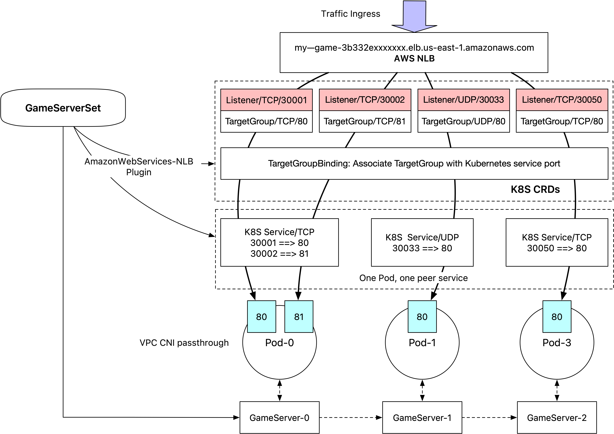

中文 | [English](./README.md)

对于在AWS EKS集群中使用OKG的游戏业务，通过网络负载均衡将流量直接路由到Pod端口是实现高性能实时服务发现的基础。利用NLB进行动态端口映射，简化了转发链路，规避了Kubernetes kube-proxy负载均衡带来的性能损耗。这些特性对于处理副本战斗类型的游戏服务器尤为关键。对于指定了网络类型为AmazonWebServices-NLB的GameServerSet，AmazonWebServices-NLB网络插件将会调度一个NLB，自动分配端口，创建侦听器和目标组，并通过TargetGroupBinding CRD将目标组与Kubernetes服务进行关联。如果集群配置了VPC-CNI，那么此时流量将自动转发到Pod的IP地址；否则将通过ClusterIP转发。观察到GameServer的网络处于Ready状态时，该过程即执行成功。


## AmazonWebServices-NLB 相关配置
### plugin配置
```toml
[aws]
enable = true
[aws.nlb]
# 填写nlb可使用的空闲端口段，用于为pod分配外部接入端口，范围最大为50(闭区间)
# 50限制来自AWS对侦听器数量的限制，参考：https://docs.aws.amazon.com/elasticloadbalancing/latest/network/load-balancer-limits.html
max_port = 32050
min_port = 32001
```
### 准备： ###

由于AWS的设计有所区别，要实现NLB端口与Pod端口映射，需要创建三类CRD资源：Listener/TargetGroup/TargetGroupBinding

#### 部署elbv2-controller：

Listener/TargetGroup的CRD定义及控制器：https://github.com/aws-controllers-k8s/elbv2-controller ，该项目联动了k8s资源与AWS云资源，chart下载：https://gallery.ecr.aws/aws-controllers-k8s/elbv2-chart ，value.yaml示例：

```yaml
serviceAccount:
  annotations:
    eks.amazonaws.com/role-arn: "arn:aws:iam::xxxxxxxxx:role/test"
aws:
  region: "us-east-1"
  endpoint_url: "https://elasticloadbalancing.us-east-1.amazonaws.com"
```

部署该项目最关键的在于授权k8s ServiceAccount访问NLB SDK，推荐通过IAM角色的方式：

##### 步骤 1：为 EKS 集群启用 OIDC 提供者

1. 登录到 AWS 管理控制台。
2. 导航到 EKS 控制台：https://console.aws.amazon.com/eks/
3. 选择您的集群。
4. 在集群详细信息页面上，确保 OIDC 提供者已启用。获取 EKS 集群的 OIDC 提供者 URL。在集群详细信息页面的 “Configuration” 部分，找到 “OpenID Connect provider URL”。

##### 步骤 2：配置 IAM 角色信任策略

创建 IAM 角色：

- 在 IAM 控制台中，创建一个新的 IAM 角色，并选择 “Custom trust policy”。

- 使用以下信任策略，允许 EKS 使用这个角色：

  ```json
  {
    "Version": "2012-10-17",
    "Statement": [
      {
        "Effect": "Allow",
        "Principal": {
          "Federated": "arn:aws:iam::<AWS_ACCOUNT_ID>:oidc-provider/oidc.eks.<REGION>.amazonaws.com/id/<OIDC_ID>"
        },
        "Action": "sts:AssumeRoleWithWebIdentity",
        "Condition": {
          "StringEquals": {
            "oidc.eks.<REGION>.amazonaws.com/id/<OIDC_ID>:sub": "system:serviceaccount:<NAMESPACE>:<SERVICE_ACCOUNT_NAME>",
            "oidc.eks.<REGION>.amazonaws.com/id/<OIDC_ID>:aud": "sts.amazonaws.com"
          }
        }
      }
    ]
  }
  ```

- 将 `<AWS_ACCOUNT_ID>`、`<REGION>`、`<OIDC_ID>`、`<NAMESPACE>` 和 `<SERVICE_ACCOUNT_NAME>` 替换为您的实际值。

- 添加权限 `ElasticLoadBalancingFullAccess`


#### 部署AWS Load Balancer Controller：

TargetGroupBinding的CRD及控制器：https://github.com/kubernetes-sigs/aws-load-balancer-controller/

官方部署文档：https://docs.aws.amazon.com/eks/latest/userguide/lbc-helm.html 其本质也是通过授权k8s ServiceAccount一个IAM角色的方式。

### 参数

#### NlbARNs
- 含义：填写nlb的arn，可填写多个，需要现在【AWS】中创建好nlb。
- 填写格式：各个nlbARN用,分割。例如：arn:aws:elasticloadbalancing:us-east-1:888888888888:loadbalancer/net/aaa/3b332e6841f23870,arn:aws:elasticloadbalancing:us-east-1:000000000000:loadbalancer/net/bbb/5fe74944d794d27e
- 是否支持变更：是

#### NlbVPCId

- 含义：填写nlb所在的vpcid，创建AWS目标组需要。
- 填写格式：字符串。例如：vpc-0bbc9f9f0ffexxxxx
- 是否支持变更：是

#### NlbHealthCheck

- 含义：填写nlb目标组的健康检查参数，可不填使用默认值。
- 填写格式：各个配置用,分割。例如："healthCheckEnabled:true,healthCheckIntervalSeconds:30,healthCheckPath:/health,healthCheckPort:8081,healthCheckProtocol:HTTP,healthCheckTimeoutSeconds:10,healthyThresholdCount:5,unhealthyThresholdCount:2"
- 是否支持变更：是
- 参数解释：
    - **healthCheckEnabled**：指示是否启用了健康检查。如果目标类型是lambda，默认情况下健康检查是禁用的，但可以启用。如果目标类型是instance、ip或alb，健康检查总是启用的，且不能禁用。
    - **healthCheckIntervalSeconds**：每个目标之间健康检查的时间间隔（以秒为单位）。 取值范围为5-300秒。如果目标组协议是TCP、TLS、UDP、TCP_UDP、HTTP或HTTPS，默认值为30秒。 如果目标组协议是GENEVE，默认值为10秒。如果目标类型是lambda，默认值为35秒。
    - **healthCheckPath**：[HTTP/HTTPS健康检查] 目标健康检查的路径。 [HTTP1或HTTP2协议版本] ping路径。默认值为/。  [GRPC协议版本] 自定义健康检查方法的路径，格式为/package.service/method。默认值为/Amazon Web Services.ALB/healthcheck。
    - **healthCheckPort**：负载均衡器在对目标执行健康检查时使用的端口。 如果协议是HTTP、HTTPS、TCP、TLS、UDP或TCP_UDP，默认值为traffic-port，这是每个目标接收负载均衡器流量的端口。 如果协议是GENEVE，默认值为端口80。
    - **healthCheckProtocol**：负载均衡器在对目标执行健康检查时使用的协议。 对于应用负载均衡器，默认协议是HTTP。对于网络负载均衡器和网关负载均衡器，默认协议是TCP。 如果目标组协议是HTTP或HTTPS，则不支持TCP协议进行健康检查。GENEVE、TLS、UDP和TCP_UDP协议不支持健康检查。
    - **healthCheckTimeoutSeconds**：在目标没有响应的情况下，认为健康检查失败的时间（以秒为单位）。取值范围为2-120秒。对于HTTP协议的目标组，默认值为6秒。对于TCP、TLS或HTTPS协议的目标组，默认值为10秒。对于GENEVE协议的目标组，默认值为5秒。如果目标类型是lambda，默认值为30秒。
    - **healthyThresholdCount**：在将目标标记为健康之前所需的连续健康检查成功次数。取值范围为2-10。如果目标组协议是TCP、TCP_UDP、UDP、TLS、HTTP或HTTPS，默认值为5。 对于GENEVE协议的目标组，默认值为5。如果目标类型是lambda，默认值为5。
    - **unhealthyThresholdCount**：指定在将目标标记为不健康之前所需的连续健康检查失败次数。取值范围为2-10。如果目标组的协议是TCP、TCP_UDP、UDP、TLS、HTTP或HTTPS，默认值为2。如果目标组的协议是GENEVE，默认值为2。如果目标类型是lambda，默认值为5。

#### PortProtocols
- 含义：pod暴露的端口及协议，支持填写多个端口/协议
- 填写格式：port1/protocol1,port2/protocol2,...（协议需大写）
- 是否支持变更：是

#### Fixed
- 含义：是否固定访问端口。若是，即使pod删除重建，网络内外映射关系不会改变
- 填写格式：false / true
- 是否支持变更：是

#### AllowNotReadyContainers
- 含义：在容器原地升级时允许不断流的对应容器名称，可填写多个
- 填写格式：{containerName_0},{containerName_1},... 例如：sidecar
- 是否支持变更：在原地升级过程中不可变更

#### Annotations
- 含义：添加在service上的anno，可填写多个
- 填写格式：key1:value1,key2:value2...
- 是否支持变更：是


### 使用示例
```shell
cat <<EOF | kubectl apply -f -
apiVersion: game.kruise.io/v1alpha1
kind: GameServerSet
metadata:
  name: gs-demo
  namespace: default
spec:
  replicas: 1
  updateStrategy:
    rollingUpdate:
      podUpdatePolicy: InPlaceIfPossible
  network:
    networkType: AmazonWebServices-NLB
    networkConf:
    - name: NlbARNs
      value: "arn:aws:elasticloadbalancing:us-east-1:xxxxxxxxxxxx:loadbalancer/net/okg-test/yyyyyyyyyyyyyyyy"
    - name: NlbVPCId
      value: "vpc-0bbc9f9f0ffexxxxx"
    - name: PortProtocols
      value: "80/TCP"
    - name: NlbHealthCheck
      value: "healthCheckIntervalSeconds:15"
  gameServerTemplate:
    spec:
      containers:
        - image: registry.cn-hangzhou.aliyuncs.com/gs-demo/gameserver:network
          name: gameserver
EOF
```

检查GameServer中的网络状态：
```
networkStatus:
    createTime: "2024-05-30T03:34:14Z"
    currentNetworkState: Ready
    desiredNetworkState: Ready
    externalAddresses:
    - endPoint: okg-test-yyyyyyyyyyyyyyyy.elb.us-east-1.amazonaws.com
      ip: ""
      ports:
      - name: "80"
        port: 32034
        protocol: TCP
    internalAddresses:
    - ip: 10.10.7.154
      ports:
      - name: "80"
        port: 80
        protocol: TCP
    lastTransitionTime: "2024-05-30T03:34:14Z"
    networkType: AmazonWebServices-NLB
```