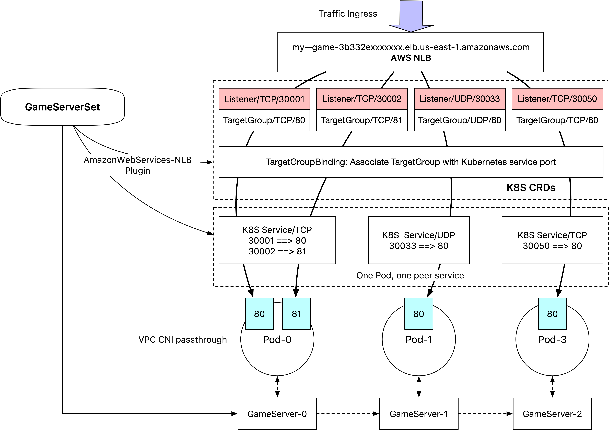

中文 | [English](./README.md)

对于在AWS EKS集群中使用OKG的游戏业务，通过网络负载均衡将流量直接路由到Pod端口是实现高性能实时服务发现的基础。利用NLB进行动态端口映射，简化了转发链路，规避了Kubernetes kube-proxy负载均衡带来的性能损耗。这些特性对于处理副本战斗类型的游戏服务器尤为关键。对于指定了网络类型为AmazonWebServices-NLB的GameServerSet，AmazonWebServices-NLB网络插件将会调度一个NLB，自动分配端口，创建侦听器和目标组，并通过TargetGroupBinding CRD将目标组与Kubernetes服务进行关联。如果集群配置了VPC-CNI，那么此时流量将自动转发到Pod的IP地址；否则将通过ClusterIP转发。观察到GameServer的网络处于Ready状态时，该过程即执行成功。


## AmazonWebServices-NLB 相关配置
### plugin配置
```toml
[aws]
enable = true
[aws.nlb]
# 填写nlb可使用的空闲端口段，用于为pod分配外部接入端口，范围最大为50(闭区间)
# 50限制来自AWS对侦听器数量的限制，参考：https://docs.aws.amazon.com/elasticloadbalancing/latest/network/load-balancer-limits.html
max_port = 32050
min_port = 32001
```
### 准备： ###

由于AWS的设计有所区别，要实现NLB端口与Pod端口映射，需要创建三类CRD资源：Listener/TargetGroup/TargetGroupBinding

#### 部署elbv2-controller：

Listener/TargetGroup的CRD定义及控制器：https://github.com/aws-controllers-k8s/elbv2-controller ，该项目联动了k8s资源与AWS云资源，chart下载：https://gallery.ecr.aws/aws-controllers-k8s/elbv2-chart ，value.yaml示例：

```yaml
serviceAccount:
  annotations:
    eks.amazonaws.com/role-arn: "arn:aws:iam::xxxxxxxxx:role/test"
aws:
  region: "us-east-1"
  endpoint_url: "https://elasticloadbalancing.us-east-1.amazonaws.com"
```

部署该项目最关键的在于授权k8s ServiceAccount访问NLB SDK，推荐通过IAM角色的方式：

##### 步骤 1：为 EKS 集群启用 OIDC 提供者

1. 登录到 AWS 管理控制台。
2. 导航到 EKS 控制台：https://console.aws.amazon.com/eks/
3. 选择您的集群。
4. 在集群详细信息页面上，确保 OIDC 提供者已启用。获取 EKS 集群的 OIDC 提供者 URL。在集群详细信息页面的 “Configuration” 部分，找到 “OpenID Connect provider URL”。

##### 步骤 2：配置 IAM 角色信任策略

1. 在 IAM 控制台中，创建一个新的身份提供商，并选择 “OpenID Connect”
   - 提供商URL填写EKS 集群的 OIDC 提供者 URL
   - 受众填写：`sts.amazonaws.com`
2. 在 IAM 控制台中，创建一个新的 IAM 角色，并选择 “Custom trust policy”。
   - 使用以下信任策略，允许 EKS 使用这个角色：
     ```json
     {
       "Version": "2012-10-17",
       "Statement": [
         {
           "Effect": "Allow",
           "Principal": {
             "Federated": "arn:aws:iam::<AWS_ACCOUNT_ID>:oidc-provider/oidc.eks.<REGION>.amazonaws.com/id/<OIDC_ID>"
           },
           "Action": "sts:AssumeRoleWithWebIdentity",
           "Condition": {
             "StringEquals": {
               "oidc.eks.<REGION>.amazonaws.com/id/<OIDC_ID>:sub": "system:serviceaccount:<NAMESPACE>:ack-elbv2-controller",
               "oidc.eks.<REGION>.amazonaws.com/id/<OIDC_ID>:aud": "sts.amazonaws.com"
             }
           }
         }
       ]
     }
     ```
   - 将 `<AWS_ACCOUNT_ID>`、`<REGION>`、`<OIDC_ID>`、`<NAMESPACE>` 和 `<SERVICE_ACCOUNT_NAME>` 替换为您的实际值。
   - 添加权限 `ElasticLoadBalancingFullAccess`


#### 部署AWS Load Balancer Controller：

TargetGroupBinding的CRD及控制器：https://github.com/kubernetes-sigs/aws-load-balancer-controller/

官方部署文档：https://docs.aws.amazon.com/eks/latest/userguide/lbc-helm.html 其本质也是通过授权k8s ServiceAccount一个IAM角色的方式。

### 参数

#### NlbARNs
- 含义：填写nlb的arn，可填写多个，需要现在【AWS】中创建好nlb。
- 填写格式：各个nlbARN用,分割。例如：arn:aws:elasticloadbalancing:us-east-1:888888888888:loadbalancer/net/aaa/3b332e6841f23870,arn:aws:elasticloadbalancing:us-east-1:000000000000:loadbalancer/net/bbb/5fe74944d794d27e
- 是否支持变更：是

#### NlbVPCId

- 含义：填写nlb所在的vpcid，创建AWS目标组需要。
- 填写格式：字符串。例如：vpc-0bbc9f9f0ffexxxxx
- 是否支持变更：是

#### NlbHealthCheck

- 含义：填写nlb目标组的健康检查参数，可不填使用默认值。
- 填写格式：各个配置用,分割。例如："healthCheckEnabled:true,healthCheckIntervalSeconds:30,healthCheckPath:/health,healthCheckPort:8081,healthCheckProtocol:HTTP,healthCheckTimeoutSeconds:10,healthyThresholdCount:5,unhealthyThresholdCount:2"
- 是否支持变更：是
- 参数解释：
    - **healthCheckEnabled**：指示是否启用了健康检查。如果目标类型是lambda，默认情况下健康检查是禁用的，但可以启用。如果目标类型是instance、ip或alb，健康检查总是启用的，且不能禁用。
    - **healthCheckIntervalSeconds**：每个目标之间健康检查的时间间隔（以秒为单位）。 取值范围为5-300秒。如果目标组协议是TCP、TLS、UDP、TCP_UDP、HTTP或HTTPS，默认值为30秒。 如果目标组协议是GENEVE，默认值为10秒。如果目标类型是lambda，默认值为35秒。
    - **healthCheckPath**：[HTTP/HTTPS健康检查] 目标健康检查的路径。 [HTTP1或HTTP2协议版本] ping路径。默认值为/。  [GRPC协议版本] 自定义健康检查方法的路径，格式为/package.service/method。默认值为/Amazon Web Services.ALB/healthcheck。
    - **healthCheckPort**：负载均衡器在对目标执行健康检查时使用的端口。 如果协议是HTTP、HTTPS、TCP、TLS、UDP或TCP_UDP，默认值为traffic-port，这是每个目标接收负载均衡器流量的端口。 如果协议是GENEVE，默认值为端口80。
    - **healthCheckProtocol**：负载均衡器在对目标执行健康检查时使用的协议。 对于应用负载均衡器，默认协议是HTTP。对于网络负载均衡器和网关负载均衡器，默认协议是TCP。 如果目标组协议是HTTP或HTTPS，则不支持TCP协议进行健康检查。GENEVE、TLS、UDP和TCP_UDP协议不支持健康检查。
    - **healthCheckTimeoutSeconds**：在目标没有响应的情况下，认为健康检查失败的时间（以秒为单位）。取值范围为2-120秒。对于HTTP协议的目标组，默认值为6秒。对于TCP、TLS或HTTPS协议的目标组，默认值为10秒。对于GENEVE协议的目标组，默认值为5秒。如果目标类型是lambda，默认值为30秒。
    - **healthyThresholdCount**：在将目标标记为健康之前所需的连续健康检查成功次数。取值范围为2-10。如果目标组协议是TCP、TCP_UDP、UDP、TLS、HTTP或HTTPS，默认值为5。 对于GENEVE协议的目标组，默认值为5。如果目标类型是lambda，默认值为5。
    - **unhealthyThresholdCount**：指定在将目标标记为不健康之前所需的连续健康检查失败次数。取值范围为2-10。如果目标组的协议是TCP、TCP_UDP、UDP、TLS、HTTP或HTTPS，默认值为2。如果目标组的协议是GENEVE，默认值为2。如果目标类型是lambda，默认值为5。

#### PortProtocols
- 含义：pod暴露的端口及协议，支持填写多个端口/协议
- 填写格式：port1/protocol1,port2/protocol2,...（协议需大写）
- 是否支持变更：是

#### Fixed
- 含义：是否固定访问端口。若是，即使pod删除重建，网络内外映射关系不会改变
- 填写格式：false / true
- 是否支持变更：是

#### AllowNotReadyContainers
- 含义：在容器原地升级时允许不断流的对应容器名称，可填写多个
- 填写格式：{containerName_0},{containerName_1},... 例如：sidecar
- 是否支持变更：在原地升级过程中不可变更

#### Annotations
- 含义：添加在service上的anno，可填写多个
- 填写格式：key1:value1,key2:value2...
- 是否支持变更：是


### 使用示例
```shell
cat <<EOF | kubectl apply -f -
apiVersion: game.kruise.io/v1alpha1
kind: GameServerSet
metadata:
  name: gs-demo
  namespace: default
spec:
  replicas: 1
  updateStrategy:
    rollingUpdate:
      podUpdatePolicy: InPlaceIfPossible
  network:
    networkType: AmazonWebServices-NLB
    networkConf:
    - name: NlbARNs
      value: "arn:aws:elasticloadbalancing:us-east-1:xxxxxxxxxxxx:loadbalancer/net/okg-test/yyyyyyyyyyyyyyyy"
    - name: NlbVPCId
      value: "vpc-0bbc9f9f0ffexxxxx"
    - name: PortProtocols
      value: "80/TCP"
    - name: NlbHealthCheck
      value: "healthCheckIntervalSeconds:15"
  gameServerTemplate:
    spec:
      containers:
        - image: registry.cn-hangzhou.aliyuncs.com/gs-demo/gameserver:network
          name: gameserver
EOF
```

检查GameServer中的网络状态：
```
networkStatus:
    createTime: "2024-05-30T03:34:14Z"
    currentNetworkState: Ready
    desiredNetworkState: Ready
    externalAddresses:
    - endPoint: okg-test-yyyyyyyyyyyyyyyy.elb.us-east-1.amazonaws.com
      ip: ""
      ports:
      - name: "80"
        port: 32034
        protocol: TCP
    internalAddresses:
    - ip: 10.10.7.154
      ports:
      - name: "80"
        port: 80
        protocol: TCP
    lastTransitionTime: "2024-05-30T03:34:14Z"
    networkType: AmazonWebServices-NLB
```
---

# AmazonWebServices-GlobalAcceleratorCustomRouting

对于以普通 Deployment/StatefulSet Pod 形式运行（Pod IP 经 VPC-CNI 可直连）的低延迟游戏服，`AmazonWebServices-GlobalAcceleratorCustomRouting` 插件通过 [AWS Global Accelerator **自定义路由（custom routing）** 加速器](https://docs.aws.amazon.com/global-accelerator/latest/dg/about-custom-routing-accelerators.html) 暴露每个 Pod。玩家连接到 AWS 边缘的静态 anycast IP，Global Accelerator 会把加速器 IP/端口确定性地映射到已注册 VPC 子网内的 Pod IP/端口，数据路径上没有负载均衡，且保留真实客户端源 IP。

与 `AmazonWebServices-NLB` 插件不同，本插件**不为数据路径创建任何 AWS 或 Kubernetes 资源**（不建 NLB、不建 TargetGroup、不建 Service）。它只在**预创建**的自定义路由 endpoint group 上按 Pod 开关流量、查询确定性端口映射，然后把结果写进 GameServer 的 `network-status` annotation。游戏服读取该 annotation（通常经 downward API），把 `agaStaticIP:mappedPort` 自报给客户端。

## 前提（由部署方创建，**插件不创建**）

插件假定以下资源已通过 CLI / SDK / Terraform 提前创建：

1. **自定义路由 accelerator + listener（端口段）+ 自定义路由 endpoint group + 已注册子网。** 端口映射容量（`子网可用 IP × 目标端口 × 协议数`）是一次性容量规划，刻意不放进 Pod 热路径。插件只从 `networkConf` 读取 endpoint group ARN 和 Pod 所属子网（`EndpointId`）。
2. **关闭集群级 SNAT**，使回程到真实客户端 IP 的流量不被改写：
   ```
   kubectl set env daemonset aws-node -n kube-system AWS_VPC_K8S_CNI_EXTERNALSNAT=true
   ```
   节点组应位于 NAT Gateway 后的私有子网。这是集群级改动，已知副作用（公有子网 Pod 失去直接出向）需提前接受。
3. **安全组**：节点 SG 必须放行来自 `0.0.0.0/0` 的游戏端口入站，因为自定义路由保留真实客户端 IP，无法限制到 AGA 自有地址段。
4. **IAM（IRSA）**：控制器的 ServiceAccount 需要 `globalaccelerator:AllowCustomRoutingTraffic`、`globalaccelerator:DenyCustomRoutingTraffic`、`globalaccelerator:ListCustomRoutingPortMappingsByDestination` 权限。凭证取自 AWS 默认凭证链；插件不绑定任何鉴权方式。

> **不做健康检查。** 自定义路由原生没有健康检查/故障转移，无论后端死活都确定性投递。插件不实现健康探测；不健康的 Pod 由 Kubernetes 自身重建（重建 → `OnPodDeleted` → `OnPodAdded` 重新解析映射）。

## `networkConf` 参数

| 名称 | 必填 | 说明 |
| --- | --- | --- |
| `CustomRoutingEndpointGroupArn` | 是 | 预创建的自定义路由 endpoint group ARN。 |
| `GamePort` | 是 | 游戏服监听的目标端口（`1`–`65535`）。 |
| `Protocol` | 否 | `TCP` 或 `UDP`，默认 `UDP`。 |
| `EndpointId` | 是 | Pod 所在的已注册 VPC **子网 ID**（即自定义路由 endpoint ID）。由用户显式填写，插件不靠试错猜测。多 AZ 场景下，把每个 GameServerSet 固定到其节点池/AZ 对应的子网。 |
| `Region` | 否 | Global Accelerator **控制面**所在 AWS region，默认 `us-west-2`。无论集群本身在哪个 region，所有 Allow/Deny/ListPortMappings 调用都打到这里。仅在其它 partition / 未来控制面 region 时才覆盖。 |

## 生命周期

| 插件钩子 | 动作 |
| --- | --- |
| `Init` | 初始化内存 cache。Global Accelerator client（aws-sdk-go-v2，默认 AWS 凭证链，region 锚定到 AGA 控制面）在首次使用时惰性构造。插件不创建 accelerator/listener/子网。 |
| `OnPodAdded` / `OnPodUpdated` | 取 `pod.Status.PodIP`；在用户指定的 `EndpointId` 上 `AllowCustomRoutingTraffic`（目标 `podIP:GamePort`）；`ListCustomRoutingPortMappingsByDestination`（分页）拿到 AGA 静态 IP + 映射端口；写 `NetworkStatus.ExternalAddresses{IP: agaStaticIP, Ports: 映射端口}`，`InternalAddresses` 填 Pod IP，状态置 `Ready`。Pod IP 未就绪或映射尚不可见时发布 `NetworkNotReady` 并返回 `(pod, nil)`（不让 error 逃出 mutating webhook 路径）。幂等：Pod IP 未变时为 no-op。Pod IP 变更（重调度）时先 `Deny` 旧 IP 再 Allow 新 IP，避免泄漏映射容量。 |
| `OnPodDeleted` | `DenyCustomRoutingTraffic`（目标 `podIP:GamePort`）排水。 |

## GameServerSet 示例

```yaml
apiVersion: game.kruise.io/v1alpha1
kind: GameServerSet
metadata:
  name: game
  namespace: default
spec:
  replicas: 3
  network:
    networkType: AmazonWebServices-GlobalAcceleratorCustomRouting
    networkConf:
      - name: CustomRoutingEndpointGroupArn
        value: "arn:aws:globalaccelerator::123456789012:accelerator/abcd1234/listener/5678/endpoint-group/9012"
      - name: GamePort
        value: "7777"
      - name: Protocol
        value: "UDP"
      - name: EndpointId
        value: "subnet-0a1b2c3d"
      # - name: Region        # 可选，默认 us-west-2
      #   value: "us-west-2"
  gameServerTemplate:
    spec:
      containers:
        - name: game
          image: your-game-image:latest
```

生成的 GameServer `network-status` 形如：

```yaml
networkStatus:
    currentNetworkState: Ready
    desiredNetworkState: Ready
    externalAddresses:
    - ip: 75.2.1.1            # AGA 静态 anycast IP —— 游戏服自报这个
      ports:
      - name: game
        port: 50001            # 自定义路由映射端口
        protocol: UDP
    internalAddresses:
    - ip: 10.0.1.23            # Pod IP
      ports:
      - name: game
        port: 7777
        protocol: UDP
    networkType: AmazonWebServices-GlobalAcceleratorCustomRouting
```
