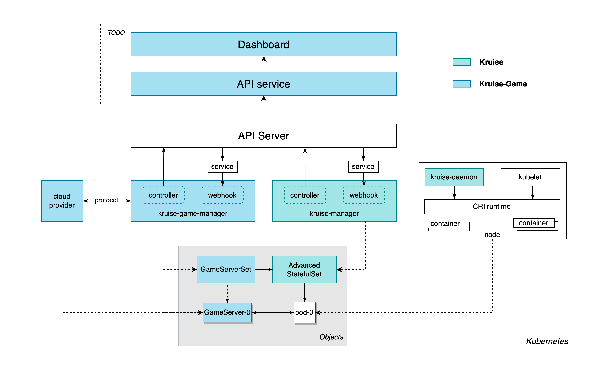

# Architecture

Kruise-Game utilizes the capabilities of Kruise, so the components of Kruise and the corresponding objects are introduced in the above figure. The turquoise part belongs to Kruise, and the light blue part belongs to Kurise-Game.

## Objects
The architecture of Kruise-Game involves the following four types of objects:

### GameServer
  - GameServer provides the game server orientation management function, and users can manually/automatically mark the game server status. The definition of game server status here is relatively broad, which can refer to the operations state, priority, network availability, etc.
  - One-to-one correspondence between GameServer and Pod. The names are the same as the corresponding Pods, which are generated with the serial number increases from 0.
  - Any operation on GameServer will not affect the game server life cycle
  - GameServer is managed by the kruise-game-manager component
### GameServerSet
  - GameServerSet implements the function of batch management of game servers, and users can define the update/scale strategy according to the GameServers status.
  - GameServerSet realizes batch management of game server life cycle by controlling Advanced StatefulSet
  - GameServerSet is managed by kruise-game-manager component
### Advanced StatefulSet
  - Enhanced StatefulSet, batch management of pod objects
  - Users may not perceive
  - Advanced StatefulSet is managed by kruise-manager component
### Pod
  - An instance of a real game server
  - Directly controlled by Advanced StatefulSet
  - Users may not perceive

## Components

### kruise
- kruise-manager
    - Kruise-manager is a control plane component that runs controllers and webhooks, it is deployed by a Deployment in kruise-system namespace. It is responsible for managing Advanced StatefulSets.
- kruise-daemon
    - It is deployed by DaemonSet, runs on every node and manages things like image pre-download, container restarting.

### kruise-game
- kruise-game-manager
    - kruise-game-manager is a control plane component that runs controllers and webhooks, it is deployed by a Deployment in kruise-game-system namespace. It is responsible for managing GameServers & GameServerSets.
- cloud provider (optional)
    - It provides network and other infrastructure services coupled with cloud vendors for game servers.
- API service & Dashboard (optional)
    - Kruise-Game will provide a series of APIs and corresponding dashboards, and users can directly manage the game server through the API/dashboard. No need to perceive K8s resources.
