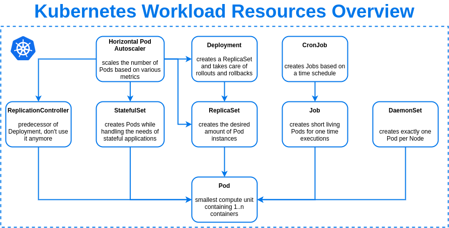

  

## Purpose of Open Source OpenKruiseGame

I have been working on cloud-native services from Swarm to Kubernetes since 2015. The types of loads running on container clusters range from websites and API services in the early phase to transcoding and AI training later, and then to Metaverse, Web3, and graphical applications. We have witnessed how cloud-native technology is changing industries one by one. However, gaming is a very special industry. A large-scale game includes different roles such as gateways, platform servers, game servers, and matching services. Many game companies have performed cloud-native transformation on services such as platform servers and gateways. However, the containerization of game servers is relatively slow. After I talked with many game developers and O&M personnel, I have found that this situation is roughly attributable to the following key reasons:

1. Replacing the deployment architecture of a running game server leads to an excessively high risk return ratio.
2. Some core features, such as game rolling update and merger and suspension of specified servers, are missing during cloud-native transformation of game servers.
2. We lack best practices and success stories on cloud-native transformation of game servers.

To solve the above problems, we have joined forces with a number of game companies such as Lingxi Games, abstracted the general capabilities for cloud-native transformation of game servers, and developed the open source project OpenKruiseGame. We hope to deliver best practices on cloud-native transformation of game servers to more game developers in an open source project that is independent of all cloud vendors. We also hope that more and more game companies, studios, and developers can join the community, discussing practical problems and scenarios with others and sharing experience in cloud-native transformation of game servers.

Liu Zhongwei, initiator of the OpenKruiseGame project, Alibaba Cloud Container Service for Kubernetes(ACK)

Lingxi Games has fully embraced cloud-native architecture. In the process of cloud-native transformation, we have clearly realized that game servers are different from other Web applications, and game server management in Kubernetes clusters is very complex. The management feature provided by Kubernetes-native workloads can hardly meet the daily O&M requirements of game servers. Deployment cannot generate fix IDs and thus is not appropriate for StatefulSet features. Whereas, StatefulSet cannot perform management on specified game servers flexibly. To overcome these difficulties, we have developed Platform as a Service (PaaS), which provides game server orchestration and management features to realize efficient O&M actions such as server activation and updates.

  Feng Moujie, head of Lingxi Games Container Cloud, Alibaba Group

As a large-scale game distribution platform, Bilibili has a large number of internal and external game projects with a heterogeneous architecture, and these projects need to be managed and maintained. In the context of reducing cost and enhancing efficiency, it is imperative to migrate game projects from traditional virtual machines to Kubernetes. However, the native Kubernetes is relatively weak in the face of scenarios such as game rolling updates, multi-environment management, abstraction of partition servers for roll server games, and service access to Internet traffic. A low-cost and efficient cross-cloud solution is required to improve the preceding situation. OpenKruiseGame is developed based on OpenKruise and provides features such as fixed ID and in-place upgrade which are appealing to gaming scenarios. This offers an alternative choice for the containerization of game servers.

	Li Ning, head of Game O&amp;M Team, Bilibili

When you try to perform cloud-native transformation of game servers, take network conditions as your primary concern. As game servers are migrated from virtual machines to containers, fixed IP addresses are required to ensure that the machine IP-based O&M method works in Kubernetes. The external service mode also becomes more complex, because it is no longer as simple as exposing ports on virtual machines. Besides, the state of each process of a game server in the pod can hardly be perceived. The recreation policy of native Kubernetes affects the game stability. Therefore, a specific perception policy is required for you to take different actions for different detection results.

	Sheng Hao, head of Game Cloud Platform, Guanying Mutual Entertainment

## Why is OpenKruiseGame a workload?

  

The key to cloud-native transformation of game servers is to address two concerns: lifecycle management and O&M management of game servers. Kubernetes has built-in general workload models such as Deployment, StatefulSet, and Job. However, the management of game server states is more fine-grained and more precise. For example, for game servers, a rolling update mechanism is required to ensure a shorter game interruption, and in-place updates are required to ensure that the network-based metadata information remains unchanged. A mechanism to ensure logouts occur only in zero-player game servers during auto scaling and the capability to allow to manually perform O&M, diagnosis, and isolation on game servers are required. The preceding requirements cannot be met by using only the built-in workloads of Kubernetes.

The workloads in Kubernetes also act as an important hub for seamless integration with infrastructure. For example, you can use the Annotations fields to implement automatic connection of the monitoring system and log system to applications, use the nodeSelector field to schedule underlying resources and bind applications to these resources, and use the labels fields to record metadata information such as groups so as to replace the traditional Configuration Management Database (CMDB) system. Therefore, custom workloads are suitable for different types of applications in Kubernetes. OpenKruiseGame is a Kubernetes workload that is designed for gaming scenarios and allows developers to perform better lifecycle management and O&M management of game servers. Moreover, developers can make advantages of capabilities of cloud products by using OpenKruiseGame without the need to develop any additional code.

## Design concept of OpenKruiseGame

OpenKruiseGame consists of only two CustomResourceDefinition (CRD) objects: GameServerSet and GameServer. The design concept of OpenKruiseGame is based on state control, which divides different responsibilities into different workloads for control.

* GameServerSet (lifecycle management)      
  Refers to the abstraction of lifecycle management for a group of game servers. It is mainly used for lifecycle control such as replica number management and game server launch.

* GameServer (management and O&M operations on specified game servers)      
  Refers to the abstraction of O&M and management operations on a specified game server. It is mainly used for O&M and management operations such as update sequence control, state control of the game server, and network changes of the game server.

After understanding the design concept of OpenKruiseGame, you can quickly draw some interesting inferences. Here are some examples:

* Will a game server be deleted if a GameServer object is accidentally deleted?

No. A game server is not deleted if a GameServer object is accidentally deleted. GameServer only records the state information about different O&M operations on a game server. If GameServer is deleted, another GameServer object that uses the default settings is created. In this case, your GameServer is recreated based on the default configurations of the game server template defined in GameServerSet.

* How do we better integrate the matching service and auto scaling to prevent players from being forced to log out?

The service quality capability can be used to convert players' tasks of a game to the state of GameServer. The matching service perceives the state of GameServer and controls the number of replicas for the scale-in or scale-out. GameServerSet also determines the sequence of deletion based on the state of GameServer, thus achieving smooth logout.

## Deployment architecture of OpenKruiseGame

  

The deployment model of OpenKruiseGame consists of three parts:

1. OpenKruiseGame controller      
   It performs lifecycle management of GameServerSet and GameServer. OpenKruiseGame controller has a built-in Cloud Provider module to adapt to the differences of different cloud service providers in scenarios such as network plug-ins. This allows OpenKruiseGame to universally deploy a set of codes for all scenarios.

2. OpenKruise controller      
   It performs lifecycle management of pods. It is a dependent component of OpenKruiseGame and the OpenKruiseGame users and developers do not need to manage the controller.

3. OpenKruiseGame O&M console [to be built]      
   It provides the O&M console and APIs for developers who want to use OpenKruiseGame in a visualized way. It allows you to perform lifecycle management and orchestration on game servers.
