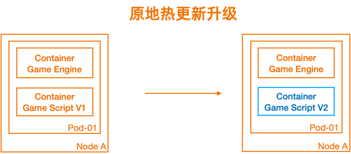

## Feature overview
In gaming scenarios, game server scripts and scenario resources are hot update files and are often deployed as sidecar containers in pods.
When these files need to be updated, we hope that the main program on the engine side of the game server is not negatively affected.
However, in a Kubernetes-native cluster, updates to a container in a pod can cause the pod to be recreated. This fails to meet the requirements of in-update.

OpenKruiseGame provides the in-place upgrade capability, which allows you to update a specific container in a pod without affecting the lifecycle of the pod as a whole.
As shown in the following figure, a hot update operation is performed on the container in blue, and no hot update operation is performed on the container in orange. After we update the version of the Game Script container from V1 to V2, the whole pod is not recreated, the container in orange is not affected, and Game Engine runs normally and smoothly.



## Example

Deploy a game server with sidecar containers. In this step, use GameServerSet as the workload of the game server, and set podUpdatePolicy to InPlaceIfPossible.

```bash
cat <<EOF | kubectl apply -f -
apiVersion: game.kruise.io/v1alpha1
kind: GameServerSet
metadata:
  name: minecraft
  namespace: default
spec:
  replicas: 3
  updateStrategy:
    rollingUpdate:
      podUpdatePolicy: InPlaceIfPossible
  gameServerTemplate:
    spec:
      containers:
        - image: registry.cn-hangzhou.aliyuncs.com/acs/minecraft-demo:1.12.2
          name: minecraft
        - image: registry.cn-hangzhou.aliyuncs.com/gs-demo/sidecar:v0.1
          name: sidecar
EOF
```

Three game servers and three corresponding pods are created:

```bash
kubectl get gs
NAME          STATE   OPSSTATE   DP    UP
minecraft-0   Ready   None       0     0
minecraft-1   Ready   None       0     0
minecraft-2   Ready   None       0     0

kubectl get pod
NAME            READY   STATUS    RESTARTS   AGE
minecraft-0     2/2     Running   0          13s
minecraft-1     2/2     Running   0          13s
minecraft-2     2/2     Running   0          13s
```

When a hot update is required, we want to update the sidecar containers without affecting the lifecycle of the whole pod. In this case, we need only to update the container image version corresponding to GameServerSet.

```bash
kubectl edit gss minecraft
...
      - image: registry.cn-hangzhou.aliyuncs.com/gs-demo/sidecar:v0.2
        name: sidecar
...
```

Wait for a period of time, then you can find that the three pods are all updated, the values of RESTARTS are all changed to 1, but the values of Age have increased. The hot update of the game server is complete.

```bash
kubectl get pod
NAME              READY   STATUS    RESTARTS      AGE
minecraft-0       2/2     Running   1 (33s ago)   8m55s
minecraft-1       2/2     Running   1 (37s ago)   8m54s
minecraft-2       2/2     Running   1 (49s ago)   8m54s
```
