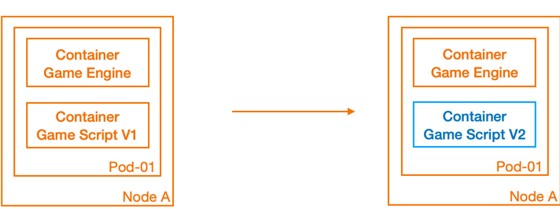

Game server update is a crucial part of game server application delivery. 
As a stateful type of service, game server updates often require higher demands on cloud-native infrastructure. 
This article mainly introduces how to use OKG's in-place update capability to achieve hot updates of game servers.

## GameServer & Container

Before introducing the hot update method, we may need to clarify the relationship between game servers and containers. 
In the concept of OKG, a game server (GameServer) can contain multiple containers, each container serving a different function and corresponding to different container images. 
Of course, a game server can also contain only one container. 
Whether a game server contains one or multiple containers corresponds to two different architectural concepts.

For game servers with only one container, they are closer to the management approach of virtual machines. 
Whether it is state management or hot updates of small versions, they do not rely on the capabilities of Kubernetes, but follow the traditional management approach. 
For example, in the single container of a game server, there may be multiple processes, scripts or configuration files. 
The game engine's resident process is usually implemented by building a new container for new version releases, and updates to new scripts, resources, or configurations often rely on object storage volumes or dynamic pulling of self-developed programs. 
And the update situation is judged by the business itself, and the entire process is carried out in a non-cloud-native manner. 
We call this type of game server a rich container. The problem with hot updates of rich containers is that:

- It is impossible to perform cloud-native version management on scripts/resources/configuration files. Since the container image has not changed, the version of the script files running in the current container is unknown to the operations personnel. After the game is launched, the iteration of small versions is very frequent. When a fault occurs, a system without version management will be difficult to locate the problem, which greatly increases the complexity of operations.
- It is difficult to locate the update status. Even if the files in the container have been updated and replaced, it is difficult to determine whether the current hot update file has been mounted when executing the reload command. The maintenance of the success or failure of this update status needs to be managed by the operations personnel, which also increases the complexity of operations to a certain extent.
- It is impossible to perform gradual upgrades. When updating, in order to control the scope of impact, it is often necessary to update the game servers with low importance first, and then gradually update the remaining game servers after confirmation. However, it is difficult to achieve gradual release, whether it is through object storage mounts or program pulling. Once there is a problem with a full release, the impact will be significant.
- When the container is abnormal, the pod rebuilds and pulls up the old version image, and the hot update file is not continuously saved.

For the hot update scenario of game servers, a more ideal approach is to use a multi-container game server architecture, where the hot update part is deployed as a sidecar container along with the main container in the same game server (GameServer), and the two share the hot update files through emptyDir. Only the sidecar container needs to be updated during updates. In this way, the hot update of game servers will be carried out in a cloud-native manner:

- The sidecar container image has version attributes, solving the version management problem.
- After the Kubernetes container update is successful, it is in the Ready state and can perceive whether the sidecar update is successful.
- OKG provides various update strategies, and the release objects can be controlled according to the release requirements to complete the gradual release.
- Even if the container is abnormally restarted, the hot update file is continuously saved along with the solidification of the image.


## Hot updates of game servers based on in-place update

### In-place update

In standard Kubernetes, application updates are implemented by changing the Image field in the resource object. 
However, in the native workload managed by Deployment or StatefulSet, the pod will be rebuilt after updating the Image, and the lifecycle of the pod is coupled with the lifecycle of the container. 
The multi-container architecture of game server hot updates mentioned earlier becomes a joke under the native workload of Kubernetes.

OKG's GameServerSet provides the ability of in-place upgrade, which can update a specific container without recreating the entire game server while ensuring that the entire game server lifecycle remains unchanged. 
During the update process of the sidecar container, the game server runs normally, and the players will not be affected.

As shown in the figure below, the blue part is the hot update part, and the orange part is the non-hot update part. 
After we update the Game Script container from version V1 to version V2, the entire pod will not be rebuilt, and the orange part will not be affected. 
The Game Engine runs smoothly and normally.



### Example Usage

In this article, we will use the 2048 web version as an example. 
In the example, we will see how to update game scripts without affecting the lifecycle of the game server.

Deploy the game server with a sidecar container using GameServerSet as the game server workload, and set:

- Choose in-place upgrade as the pod update strategy
- Use AlibabaCloud-SLB network model to expose services
- There are two containers, where app-2048 is the main container that carries the main game logic, and the sidecar is the companion container that stores the hot update files. The two containers share a file directory through emptyDir.
  - When the sidecar starts, it synchronizes the files in the directory that stores the hot update files (/app/js) to the shared directory (/app/scripts), and sleeps without exiting after synchronization.
  - The app-2048 container uses the game scripts under the /var/www/html/js directory.


```bash
cat <<EOF | kubectl apply -f -
apiVersion: game.kruise.io/v1alpha1
kind: GameServerSet
metadata:
  name: gss-2048
  namespace: default
spec:
  replicas: 1
  updateStrategy:
    rollingUpdate:
      podUpdatePolicy: InPlaceIfPossible
  network:
    networkType: AlibabaCloud-SLB
    networkConf:
      - name: SlbIds
        value: lb-bp1oqahx3jnr7j3f6vyp8
      - name: PortProtocols
        value: 80/TCP
  gameServerTemplate:
    spec:
      containers:
        - image: registry.cn-beijing.aliyuncs.com/acs/2048:v1.0
          name: app-2048
          volumeMounts:
            - name: shared-dir
              mountPath: /var/www/html/js
        - image: registry.cn-beijing.aliyuncs.com/acs/2048-sidecar:v1.0
          name: sidecar
          args:
            - bash
            - -c
            - rsync -aP /app/js/* /app/scripts/ && while true; do echo 11;sleep 2; done
          volumeMounts:
            - name: shared-dir
              mountPath: /app/scripts
      volumes:
        - name: shared-dir
          emptyDir: {}
EOF
```

Create one GameServer and its corresponding Pod.

```bash
kubectl get gs
NAME          STATE   OPSSTATE   DP    UP   AGE
gss-2048-0    Ready   None       0     0    13s

kubectl get pod
NAME          READY   STATUS    RESTARTS   AGE
gss-2048-0    2/2     Running   0          13s
```

At this point, access the game webpage (the game server network-related content can refer to the network model documentation), and when the game ends, the `Game over!` message will be displayed.


Next, we want to update the game server script to change the display message when the game ends to `*_* Game over!`

Modify the corresponding script file html_actuator.js, and build a new sidecar image, naming the image tag as v2.0. (In actual production, this process can be completed through the CI process.)

After building & pushing the image, only need to update the container image tag corresponding to the GameServerSet.

```bash
kubectl edit gss gss-2048
...
      - image: registry.cn-beijing.aliyuncs.com/acs/2048-sidecar:v2.0
        name: sidecar
...
```

After a period of time, it was noticed that the gs has changed from Updating to Ready, the Pod has been updated, the restarts count has changed to 1, but the Age has not decreased.

```bash
kubectl get pod
NAME             READY   STATUS    RESTARTS      AGE
gss-2048-0       2/2     Running   1 (33s ago)   8m55s
```

At this point, execute the reload command on the app-2048 container.

```bash
kubectl exec gss-2048-0 -c app-2048 -- /usr/sbin/nginx -s reload
```

Open an incognito browser, play the game, and the updated message will be displayed when the game ends.


### Reload methods after file hot update

In the example above, the exec command was used to reload a single pod. 
However, when managing in batches, the reload operation becomes too cumbersome and complex. 
Below are a few file hot reload methods for reference.

#### Manual batch reload

When all game servers are updated to Ready, use the batch management tool `kubectl-pexec` to execute the exec reload command in the container in batches. 

#### Track the hot update file directory through inotify

inotify is a Linux file monitoring system framework. Through inotify, the main game server business container can listen for changes in files in the hot update file directory, triggering an update.

To use inotify, you need to install inotify-tools in the container: 

```bash
apt-get install inotify-tools
```

Taking the 2048 game as an example, on top of the original image, the app-2048 container listens to the /var/www/html/js/ directory, and automatically executes the reload command when it detects changes in the file. 

The script is shown below and can be executed when the container starts. 
It is worth noting that the reload command should be idempotent.

```shell
inotifywait -mrq --timefmt '%d/%m/%y %H:%M' --format '%T %w%f%e' -e modify,delete,create,attrib /var/www/html/js/ |  while read file
do
	/usr/sbin/nginx -s reload
	echo "reload successfully"
done
```

The above program is integrated into the image and a new image `registry.cn-beijing.aliyuncs.com/acs/2048:v1.0-inotify` is built. 
In the subsequent experiment (with other fields unchanged), it can be observed that the entire hot update process no longer requires manual input of the reload command after the sidecar image is replaced with v2.0.
The complete YAML is as follows:

```yaml
kind: GameServerSet
metadata:
  name: gss-2048
  namespace: default
spec:
  replicas: 1
  updateStrategy:
    rollingUpdate:
      podUpdatePolicy: InPlaceIfPossible
  network:
    networkType: AlibabaCloud-SLB
    networkConf:
      - name: SlbIds
        value: lb-bp1oqahx3jnr7j3f6vyp8
      - name: PortProtocols
        value: 80/TCP
  gameServerTemplate:
    spec:
      containers:
        - image: registry.cn-beijing.aliyuncs.com/acs/2048:v1.0-inotify
          name: app-2048
          volumeMounts:
            - name: shared-dir
              mountPath: /var/www/html/js
        - image: registry.cn-beijing.aliyuncs.com/acs/2048-sidecar:v1.0 #Replace with v2.0 during hot update
          name: sidecar
          args:
            - bash
            - -c
            - rsync -aP /app/js/* /app/scripts/ && while true; do echo 11;sleep 2; done
          volumeMounts:
            - name: shared-dir
              mountPath: /app/scripts
      volumes:
        - name: shared-dir
          emptyDir: {}
```

### Triggering HTTP requests in the sidecar

The main game server business container exposes an HTTP interface, and the sidecar sends a reload request to 127.0.0.1 after it successfully starts. 
Due to the fact that the containers in the pod share the same network namespace, the main container will perform file reloads upon receiving the request.

Taking the 2048 game as an example, on top of the original image:

- The app-2048 container adds a reload interface. Below is an example of the JS code:

  ```js
  var http = require('http');
  var exec = require('child_process').exec;
  
  var server = http.createServer(function(req, res) {
    if (req.url === '/reload') {
      exec('/usr/sbin/nginx -s reload', function(error, stdout, stderr) {
        if (error) {
          console.error('exec error: ' + error);
          res.statusCode = 500;
          res.end('Error: ' + error.message);
          return;
        }
        console.log('stdout: ' + stdout);
        console.error('stderr: ' + stderr);
        res.statusCode = 200;
        res.end();
      });
    } else {
      res.statusCode = 404;
      res.end('Not found');
    }
  });
  
  server.listen(3000, function() {
    console.log('Server is running on port 3000');
  });
  ```
  
- At the same time, the sidecar container adds a request script request.sh. After the container is started, the postStart hook is used to add the command to send the request, as shown below:

  ```yaml
  ...
            name: sidecar
            lifecycle:
              postStart:
                exec:
                  command:
                    - bash
                    - -c
                    - ./request.sh
  ...
  ```
  The corresponding request.sh script is shown below, which has a retry mechanism and will exit only after confirming that the reload was successful.

  ```shell
  #!/bin/bash
  
  # 循环发送 HTTP 请求，直到服务器返回成功响应为止
  while true; do
    response=$(curl -s -w "%{http_code}" http://localhost:3000/reload)
    if [[ $response -eq 200 ]]; then
      echo "Server reloaded successfully!"
      break
    else
      echo "Server reload failed, response code: $response"
    fi
    sleep 1
  done
  ```

In this way, automatic reload can be achieved after file updates.

The above program is integrated into the image and a new image is built as follows:
- `registry.cn-beijing.aliyuncs.com/acs/2048:v1.0-http`
- `registry.cn-beijing.aliyuncs.com/acs/2048-sidecar:v1.0-http`
- `registry.cn-beijing.aliyuncs.com/acs/2048-sidecar:v2.0-http` 

Replace the new image and run the experiment again (note that the sidecar in the YAML needs to add the lifecycle field). 
After replacing the v1.0-http sidecar image with v2.0-http, it can be observed that the entire hot update process no longer requires manual input of the reload command.
The complete YAML is as follows:

```yaml
kind: GameServerSet
metadata:
  name: gss-2048
  namespace: default
spec:
  replicas: 1
  updateStrategy:
    rollingUpdate:
      podUpdatePolicy: InPlaceIfPossible
  network:
    networkType: AlibabaCloud-SLB
    networkConf:
      - name: SlbIds
        value: lb-bp1oqahx3jnr7j3f6vyp8
      - name: PortProtocols
        value: 80/TCP
  gameServerTemplate:
    spec:
      containers:
        - image: registry.cn-beijing.aliyuncs.com/acs/2048:v1.0-http
          name: app-2048
          volumeMounts:
            - name: shared-dir
              mountPath: /var/www/html/js
        - image: registry.cn-beijing.aliyuncs.com/acs/2048-sidecar:v1.0-http #Replace with v2.0-http during hot update
          name: sidecar
          lifecycle:
            postStart:
              exec:
                command:
                  - bash
                  - -c
                  - ./request.sh
          args:
            - bash
            - -c
            - rsync -aP /app/js/* /app/scripts/ && while true; do echo 11;sleep 2; done
          volumeMounts:
            - name: shared-dir
              mountPath: /app/scripts
      volumes:
        - name: shared-dir
          emptyDir: {}
```

#### Fully managed hot reload

OKG has the ability to trigger the execution of commands in containers. 
Based on this feature, OKG can provide fully automated hot update capabilities, allowing users to no longer overly concern themselves with hot reload issues.
If you have such requirements, you can submit an issue on GitHub and discuss the OKG hot reload feature development roadmap with community developers.

### In-place hot update during server downtime

In a gaming scenario, hot update in a narrow sense refers to updates that do not affect players' normal gameplay without stopping the server. 
However, in some scenarios, game server downtime updates also require in-place upgrade capabilities.

#### Network metadata remains unchanged

The stateful nature of game servers is often reflected in network information. 
Since each game server is unique and cannot use the concept of k8s service load balancing, game developers often implement routing and distribution mechanisms based on IP. 
In this case, when updating the game, we need to avoid changes in the game server IP information. 
OKG's in-place upgrade capability can meet the above requirements.

#### Shared memory is not lost
After the game server is created, it is scheduled to a certain host, and the game business uses shared memory to reduce data write latency, so that the game server adds a layer of cache locally. 
During game server updates, although there may be a short service interruption, due to the existence of the cache, the game server has a fast termination and startup speed, and the downtime is greatly reduced. 
The implementation of shared memory also depends on OKG's in-place upgrade capabilities to ensure that the corresponding cache data is not lost.