## kruise-game

English | [Chinese](../中文/说明文档.md)
### Overview

OpenKruiseGame (OKG) is a multicloud-oriented, open source Kubernetes workload specialized for game servers. It is a sub-project of the open source workload project OpenKruise of the Cloud Native Computing Foundation (CNCF) in the gaming field. OpenKruiseGame makes the cloud-native transformation of game servers easier, faster, and stabler.

  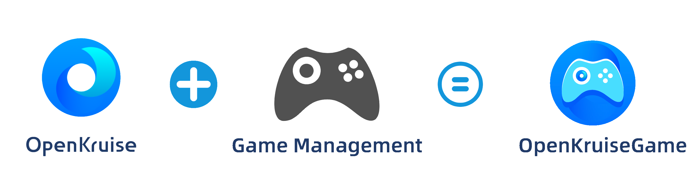

### What is OpenKruiseGame?
OpenKruiseGame is a custom Kubernetes workload designed specially for game server scenarios. It simplifies the cloud-native transformation of game servers. Compared with the built-in workloads of Kubernetes, such as Deployment and StatefulSet, OpenKruiseGame provides common game server management features, such as hot update, in-place update, and management of specified game servers.

In addition, OpenKruiseGame connects game servers to cloud service providers, matchmaking services, and O&M platforms. It automatically integrates features such as logging, monitoring, network, storage, elasticity, and matching by using low-code or zero-code technologies during the cloud-native transformation of game servers. With the consistent delivery standard of Kubernetes, OpenKruiseGame implements centralized management of clusters on multiple clouds and hybrid clouds.

OpenKruiseGame is a fully open source project. It allows developers to customize workloads and build the release and O&M platforms for game servers by using custom development. OpenKruiseGame can use Kubernetes templates or call APIs to use or extend features. It can also connect to delivery systems, such as KubeVela, to implement the orchestration and full lifecycle management of game servers on a GUI.

### Why is OpenKruiseGame needed?

Kubernetes is an application delivery and O&M standard in the cloud-native era. The capabilities of Kubernetes such as declarative resource management, auto scaling, and consistent delivery in a multi-cloud environment can provide support for game server scenarios that cover fast server activation, cost control, version management, and global reach. However, certain features of game servers make it difficult to adapt game servers for Kubernetes. For example:

* Hot update or hot reload

To ensure a better game experience for players, many game servers are updated by using hot update or hot reload. However, for various workloads of Kubernetes, the lifecycle of pods is consistent with that of images. When an image is published, pods are recreated. When pods are recreated, issues may occur such as interruptions to player battles and changes in the network metadata of player servers.

* O&M for specified game servers

Game servers are stateful in most scenarios. For example, when a player versus player (PVP) game is updated or goes offline, only game servers without online active players can be changed; when game servers for a player versus environment (PVE) game are suspended or merged, you can perform operations on game servers with specific IDs.

* Network models suitable for games

The network models in Kubernetes are implemented by declaring Services. In most cases, the network models are applicable to stateless scenarios. For network-sensitive game servers, a solution with high-performance gateways, fixed IP addresses and ports, or lossless direct connections is more suitable for actual business scenarios.

* Game server orchestration

The architecture of game servers has become increasingly complex. The player servers for many massive multiplayer online role-playing games (MMORPGs) are combinations of game servers with different features and purposes, such as a gateway server responsible for network access, a central server for running the game engine, and a policy server responsible for game scripts and gameplay. Different game servers have different capacities and management policies. Hence, it is difficult to describe and quickly deliver all the game servers by using a single workload type.

The preceding challenges make it difficult to implement cloud-native transformation of game servers. OpenKruiseGame is aimed to abstract the common requirements of the gaming industry, and use the semantic method to make the cloud-native transformation of various game servers simple, efficient, and secure.

### List of core features

OpenKruiseGame has the following core features:

* Hot update based on images and hot reload of configurations
* Update, deletion, and isolation of specified game servers
* Multiple built-in network models (fixed IP address and port, lossless direct connection, and global acceleration)
* Auto scaling
* Automated O&M (service quality)
* Independent of cloud service providers
* Complex game server orchestration

### Users of OpenKruiseGame(OKG)

<table>
    <tr style="border: none;">
        <td style="border: none;">
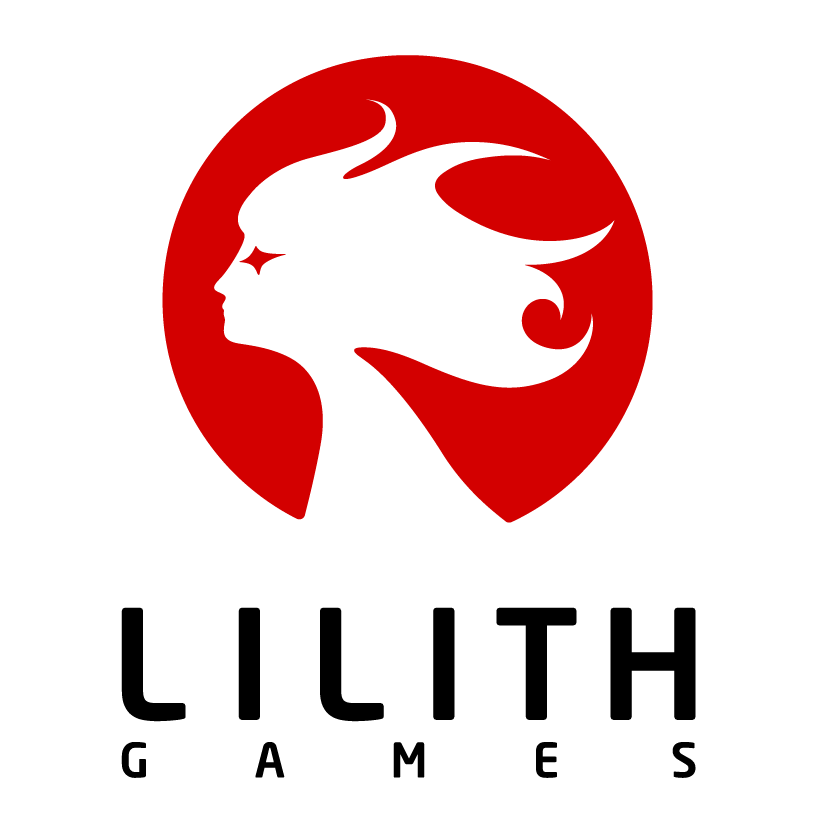
</td>
        <td style="border: none;">

</td>
        <td style="border: none;">
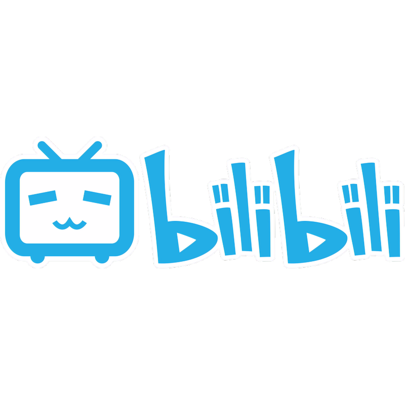
</td>
        <td style="border: none;">
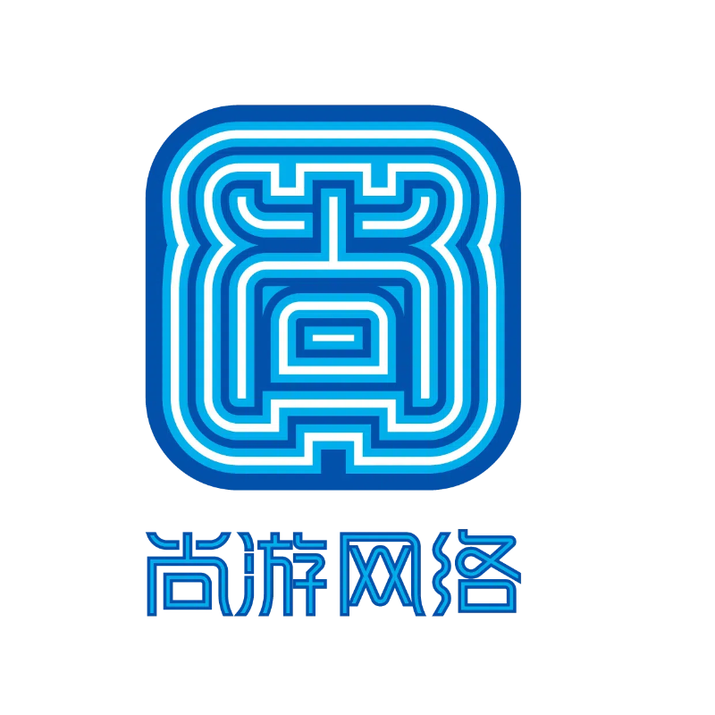
</td>
        <td style="border: none;">

</td>
        <td style="border: none;">
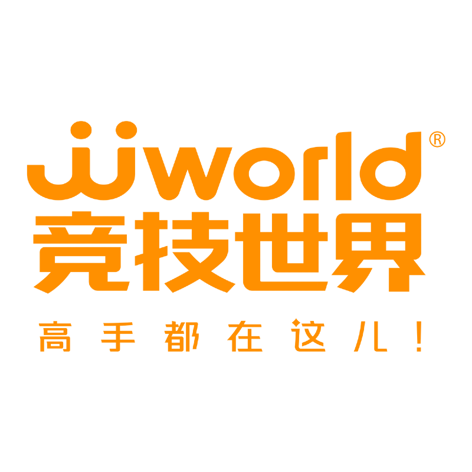
</td>
    </tr>
    <tr style="border: none;">
        <td style="border: none;">
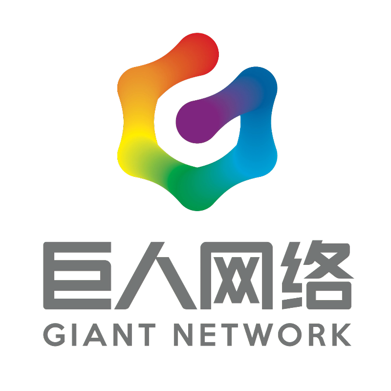
</td>
        <td style="border: none;">
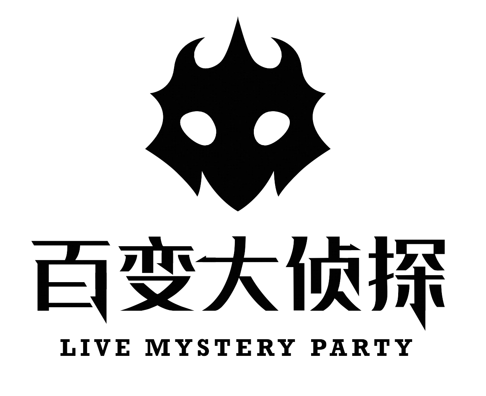
</td>
        <td style="border: none;">

</td>
        <td style="border: none;">
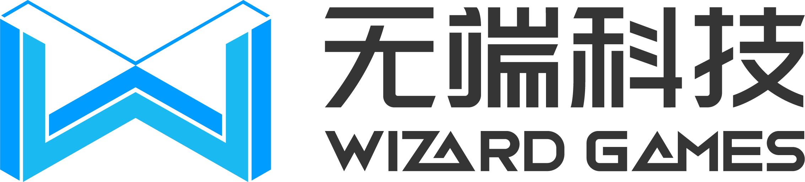
</td>
        <td style="border: none;">

</td>
        <td style="border: none;">
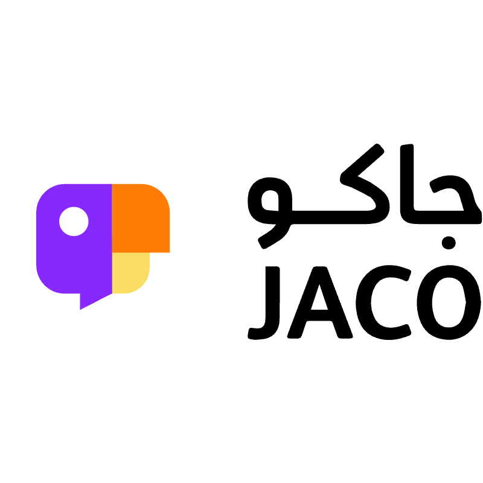
</td>
    </tr>
    <tr style="border: none;">
        <td style="border: none;">
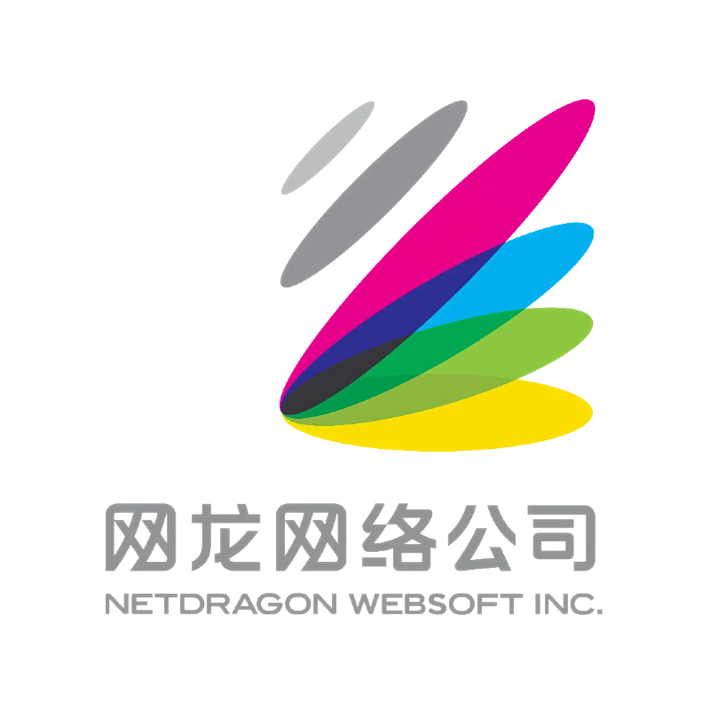
</td>
        <td style="border: none;">

</td>
        <td style="border: none;">

</td>
        <td style="border: none;">

</td>
        <td style="border: none;">

</td>
        <td style="border: none;">
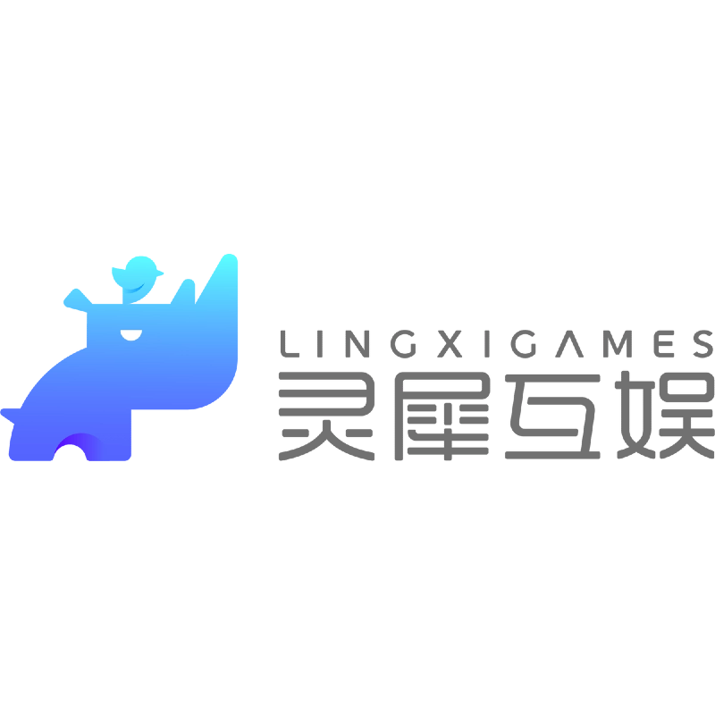
</td>
    </tr>
    <tr style="border: none;">
        <td style="border: none;">

</td>
        <td style="border: none;">

</td>
        <td style="border: none;">

</td>
        <td style="border: none;">

</td>
        <td style="border: none;">

</td>
        <td style="border: none;">
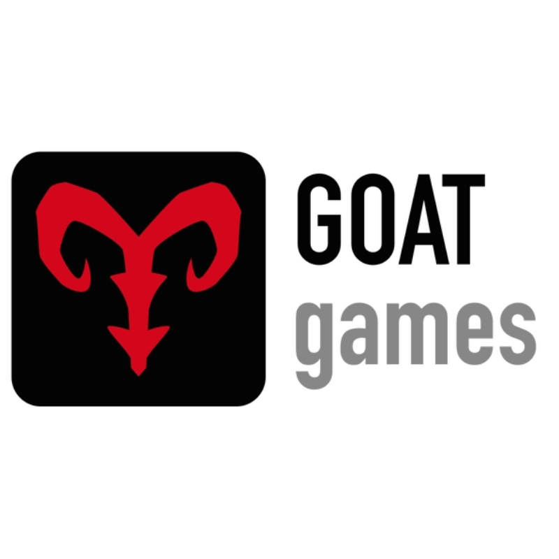
</td>
    </tr>
    <tr style="border: none;">
        <td style="border: none;">
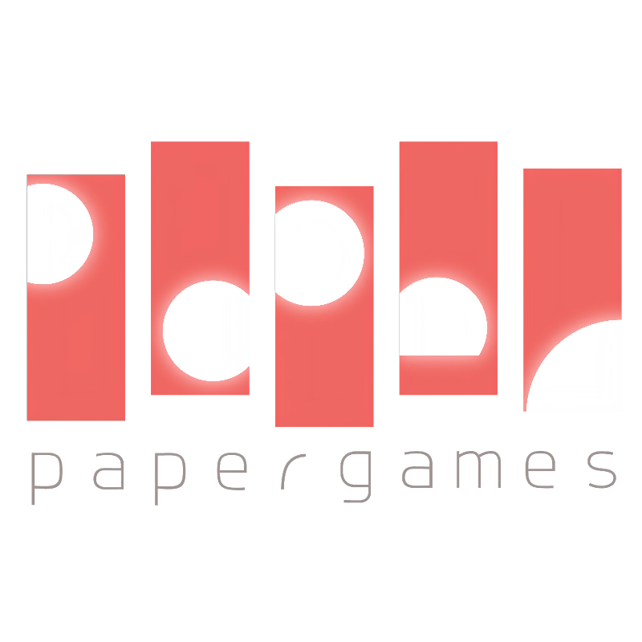
</td>
        <td style="border: none;">
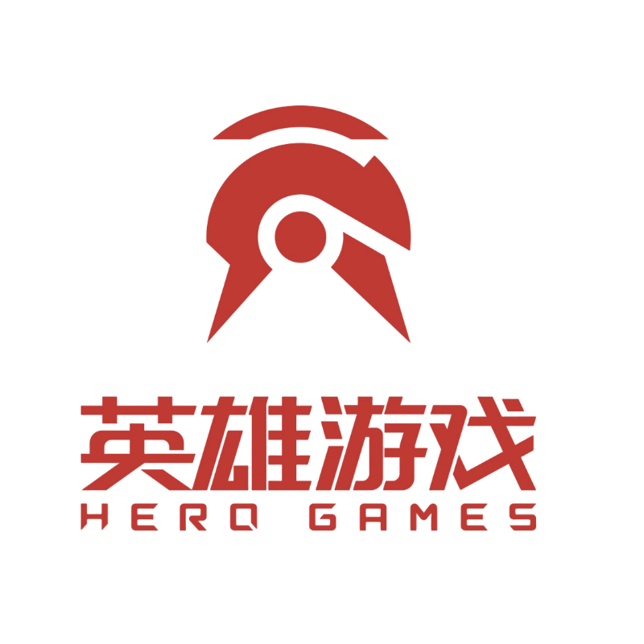
</td>
        <td style="border: none;">

</td>
        <td style="border: none;">
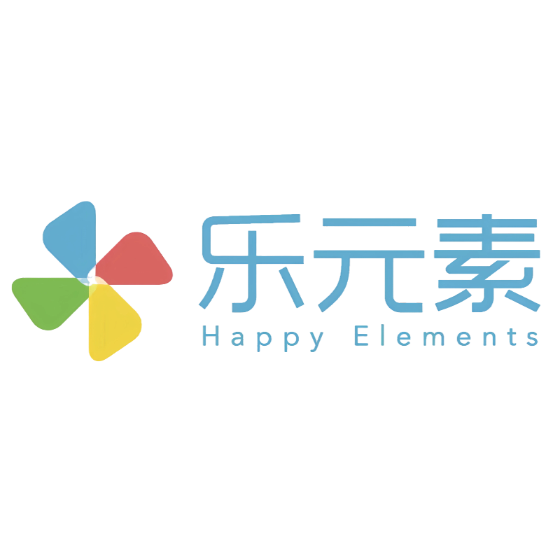
</td>
        <td style="border: none;">
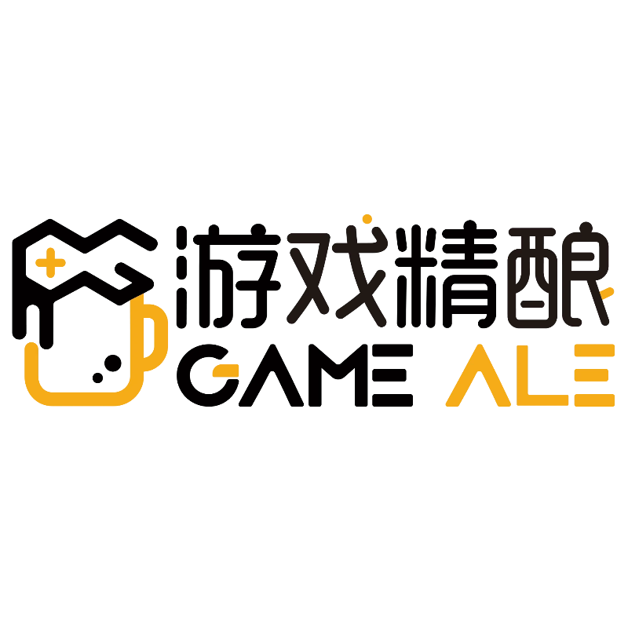
</td>
        <td style="border: none;">
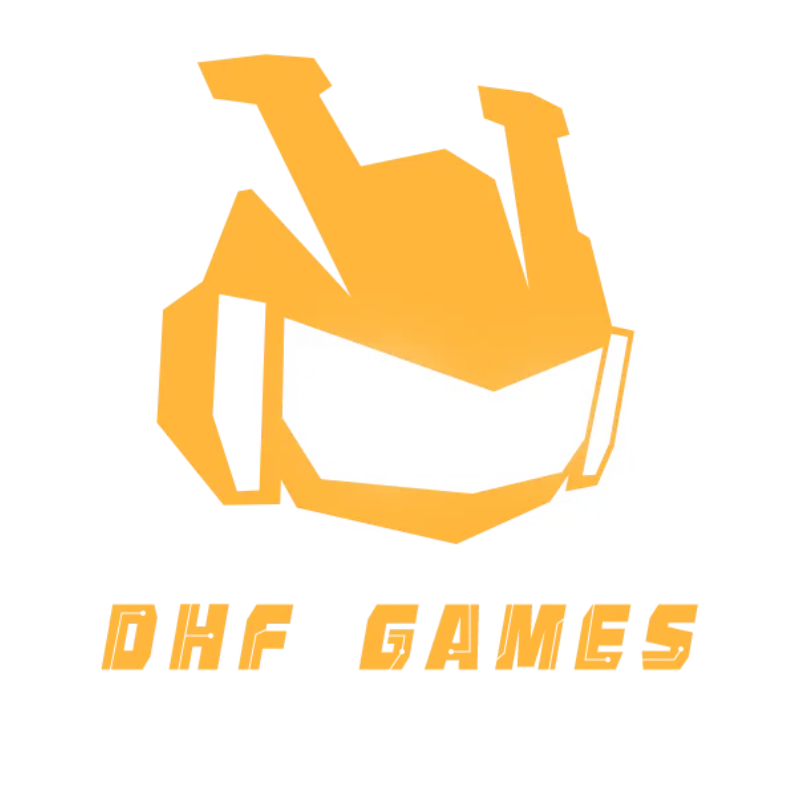
</td>
    </tr>
</table>

### What to do next

* Install and use OpenKruiseGame. For more information, see [Getting Started](./getting_started).
* Submit code for OpenKruiseGame. For more information, see [Developer Guide](./developer_manuals/contribution.md).
* Submit [issues](https://github.com/openkruise/kruise-game/issues) to offer suggestions for OpenKruiseGame or discuss the best practices of cloud-native transformation of games.
* Join the DingTalk group (ID: 44862615) to have a discussion with core contributors to OpenKruiseGame.
* Contact us by email at zhongwei.lzw@alibaba-inc.com.

