# Observability

This guide targets OpenKruiseGame operators (SRE, DevOps, platform engineers). It explains how to enable the OpenTelemetry pipeline, where each signal comes from, and how to read controller/network health from the exported data.

## 1. Enable the pipeline

The controller manager binary already contains log, trace, and metric instrumentation. You only need to:

1. Deploy an OpenTelemetry Collector (see §5). The manifests under `test/e2e/manifests` are production-ready samples.
2. Pass the following flags to the `kruise-game-controller-manager` container:

   ```yaml
   - --enable-tracing=true                # enable span export + remote logs
   - --otel-collector-endpoint=otel-collector.observability.svc.cluster.local:4317
   - --otel-sampling-rate=1.0             # tune down only if needed
   - --log-format=json                    # <optional> set stdout/stderr log format
   ```
3. Make sure the Downward API injects namespace/pod metadata:

   ```yaml
         env:
           - name: POD_NAME
             valueFrom:
               fieldRef:
                 fieldPath: metadata.name
           - name: POD_NAMESPACE
             valueFrom:
               fieldRef:
                 fieldPath: metadata.namespace
           - name: POD_UID
             valueFrom:
               fieldRef:
                 fieldPath: metadata.uid
   ```
   These values are propagated to logs/traces/metrics as `service.*` and `k8s.*` attributes.

## 2. Logging

- `--log-format` controls only what you see in `kubectl logs` (`console` or `json`). The default is console.
- **OTLP bridge**: once `--otel-collector-endpoint` is set, the controller wraps the local zap core with a tee that forwards every log entry to `otelzap` before the console/JSON encoder runs. The collector therefore always receives fully structured OTLP logs—even when stdout stays in console mode—so Grafana/Loki keep the rich metadata without sacrificing human-readable pod logs.
- `logging.FromContextWithTrace(ctx)` is used across controllers/webhooks so every log emitted inside a span carries `trace_id` and `span_id`. Collectors (using the `transform/log_trace_labels` processor from §5) can therefore correlate log lines back to traces.


## 3. Distributed tracing

- Enable tracing with `--enable-tracing=true` and point to your collector via `--otel-collector-endpoint`.
- `--otel-sampling-rate` sets the `TraceIDRatioBased` sampler. Values between 0 and 1 are accepted; invalid values abort startup.
- Controllers emit spans for every `GameServer` and `GameServerSet` reconcile. Attributes include:
  - `game.kruise.io.game_server.name` / `.namespace`
  - `game.kruise.io.game_server_set.name`
  - `game.kruise.io.network.status` (e.g., `waiting`, `ready`, `error`)
- `GameServerManager` writes a `game.kruise.io/traceparent` annotation onto Pods. The admission webhook reads it, links its own span to the reconcile trace, and records the network plugin it invoked.
- Cloud provider plugins (Alibaba NLB, Kubernetes NodePort/HostPort) wrap every allocate/deallocate/service operation in spans so you can inspect latency or errors per plugin.

**Operational tips**

- Spans fall back to a no-op provider when OTLP dialing fails; the controller logs `Tracing initialization failed, using no-op tracer` in that case.
- Search for traces & logs by attributes like `game.kruise.io.game_server.name`, `game.kruise.io.network.plugin.name`, `cloud.provider`, or `k8s.namespace.name`, you can find them at `pkg/tracing/attributes.go`.

## 4. Metrics

### 4.1 Native controller metrics (`/metrics`)

These are registered in `pkg/metrics/prometheus_metrics.go` and exposed at the manager’s `--metrics-bind-address` (default `:8080`). Scrape them with Prometheus or the collector’s `prometheus/native` receiver.

| Metric | Type | Labels | What it tells you |
| --- | --- | --- | --- |
| `okg_gameservers_state_count` | Gauge | `state` | Live GameServer distribution across states. |
| `okg_gameservers_opsState_count` | Gauge | `opsState`, `gssName`, `namespace` | Number of GameServers in operational states. |
| `okg_gameservers_total` | Counter | – | Cumulative GameServers processed since controller start. |
| `okg_gameserversets_replicas_count` | Gauge | `gssName`, `gssNs`, `gsStatus` | Replica counts per GameServerSet broken down by GameServer status. |
| `okg_gameserver_deletion_priority` | Gauge | `gsName`, `gsNs` | Active deletion priority value for each GameServer. |
| `okg_gameserver_update_priority` | Gauge | `gsName`, `gsNs` | Update priority value. |
| `okg_gameserver_ready_duration_seconds` | Gauge | `gsName`, `gsNs`, `gssName` | Time from creation to `Ready`. |
| `okg_gameserver_network_ready_duration_seconds` | Gauge | `gsName`, `gsNs`, `gssName` | Time until `NetworkStatus.Ready`. Spikes indicate plugin issues. |

Suggested alerts/dashboards:
- `histogram_quantile(0.95, rate(okg_gameserver_network_ready_duration_seconds[5m]))` > SLA
- `okg_gameservers_state_count{state="NetworkNotReady"}` cresting triggers scaling or plugin investigation

### 4.2 Span-derived network metrics (`okg_network` namespace)

The collector’s `spanmetrics` connector turns network spans into Prometheus metrics:

- **Counters**: span count per plugin/operation/status (RED “R”).
- **Histograms**: latency of port allocation/service operations (RED “L”). Buckets are defined in the manifest (`0.01s`, `0.1s`, … `10s`).
- **Error ratios**: filter by `status.code="ERROR"` or `game.kruise.io.network.status="error"` to see failure percentages.
- **Exemplars**: enabled so Grafana panels can link directly back to Tempo traces.

Use these metrics to answer questions such as “Which provider is causing 5xx latency?” (`sum(rate(okg_network_calls_total{cloud_provider="alibaba_cloud",status_code="ERROR"}[5m]))`) or “Is NLB port allocation exceeding 500 ms?” (`histogram_quantile(0.95, rate(okg_network_latency_seconds_bucket{game_kruise_io_network_plugin_name="AlibabaCloud-NLB"}[5m]))`).

## 5. Collector deployment

You can reuse the sample stack from `test/e2e/manifests` (namespace `observability`). Two variants are available:

- `01-otel-collector.yaml`: local stack (Tempo/Loki/Prometheus inside the cluster).
- `01-otel-collector-grafana.yaml`: dual-write stack that mirrors everything to Grafana Cloud via OTLP / Prometheus Remote Write while keeping the local sinks.

- **Receivers**:
  - OTLP gRPC/HTTP (`traces`, `logs`)
  - Prometheus scrape of the controller (`prometheus/native`)
  - `spanmetrics` connector (receives spans from `traces/network` pipeline and generates RED metrics)

- **Processors**:
  - `k8sattributes`: Injects `k8s.pod.ip`/`k8s.pod.uid` labels for all signals.
  - `transform/log_trace_labels`: Copies `trace_id`/`span_id` into log attributes so Loki can pivot back to traces.
  - `tail_sampling`: Keeps error/slow traces while sampling everything else probabilistically.
  - `filter/network_only`: Feeds only network plugin spans into the spanmetrics connector to avoid noise.

- **Pipelines**:
  - `traces/network` → `filter/network_only` → `spanmetrics connector` (Generates metrics)
  - `metrics/network` (Source: spanmetrics) → `prometheus/local` (:8889) + `prometheusremotewrite` (Cloud)
  - `metrics/native` (Source: controller :8080) → `prometheus/local` (:8889) + `prometheusremotewrite` (Cloud)
  - `traces/storage` → Tempo + Grafana Cloud
  - `logs` → Loki + Grafana Cloud

- **Exports**:
  - **Local (Pull)**: `prometheus/local` exposes **aggregated metrics** (both native and span-derived) on `:8889` for the local Prometheus to scrape.
  - **Local (Push)**: `otlp/tempo` and `otlphttp/loki` push directly to local storage backends.
  - **Cloud (Push)**: `otlphttp/grafana_cloud` and `prometheusremotewrite/grafana_cloud` push data to Grafana Cloud endpoints.
  - **Self-Monitoring**: The collector exposes its own telemetry on `:8888`.

```mermaid
graph LR
    classDef metrics fill:#e1f5fe,stroke:#01579b,stroke-width:2px;
    classDef traces fill:#fce4ec,stroke:#880e4f,stroke-width:2px;
    classDef logs fill:#e8f5e9,stroke:#1b5e20,stroke-width:2px;
    classDef store fill:#fff3e0,stroke:#e65100,stroke-width:2px,stroke-dasharray: 5 5;
    classDef cloud fill:#f3e5f5,stroke:#4a148c,stroke-width:2px,stroke-dasharray: 5 5;

    subgraph Sources [Telemetry Sources]
        direction TB
        CM[Controller Manager]
        CM_Metrics[Native Metrics :8080]:::metrics
        CM_Trace[OTLP Trace]:::traces
        CM_Log[OTLP Log]:::logs
        
        CM --> CM_Metrics
        CM --> CM_Trace
        CM --> CM_Log
    end

    subgraph Collector [OTel Collector]
        
        subgraph Receivers [Receivers]
            direction TB
            Receiver_Prom[Prometheus/Native]:::metrics
            Receiver_OTLP[OTLP Receiver]:::traces
        end

        subgraph Processors [Processors & Connectors]
            direction TB
            Processor_Filter[Filter: Network Only]:::traces
            Connector_SpanMetrics[Connector: SpanMetrics]:::metrics
        end
        
        subgraph Pipelines [Pipelines]
            direction TB
            Pipeline_Native[Metrics: Native]:::metrics
            Pipeline_Network[Metrics: Network]:::metrics
            Pipeline_Trace[Traces: Storage]:::traces
            Pipeline_Log[Logs]:::logs
        end

        subgraph Exporters [Exporters]
            direction TB
            Exporter_PromLocal[Prometheus Local :8889]:::metrics
            Exporter_RemoteWrite[Remote Write]:::metrics
            Exporter_Tempo[OTLP Tempo]:::traces
            Exporter_Loki[OTLP Loki]:::logs
            Exporter_CloudOTLP[OTLP Grafana]:::traces
        end
    end

    subgraph Storage [Storage Backends]
        direction TB
        
        subgraph Local_Cluster [Local Cluster]
            LocalProm[Local Prometheus]:::store
            Tempo[Tempo]:::store
            Loki[Loki]:::store
        end

        subgraph Cloud_Platform [Grafana Cloud]
            GC_Prom[Hosted Prometheus]:::cloud
            GC_OTLP[Hosted OTLP - Trace/Log]:::cloud
        end
    end

    %% 1. Sources -> Receivers
    CM_Metrics -->|Scrape| Receiver_Prom
    CM_Trace -->|gRPC| Receiver_OTLP
    CM_Log -->|gRPC| Receiver_OTLP

    %% 2. Receivers -> Pipelines / Processors
    Receiver_Prom --> Pipeline_Native
    Receiver_OTLP --> Pipeline_Trace
    Receiver_OTLP --> Pipeline_Log
    
    Receiver_OTLP --> Processor_Filter --> Connector_SpanMetrics
    Connector_SpanMetrics --> Pipeline_Network

    %% 3. Pipelines -> Exporters
    
    %% Metrics Flow
    Pipeline_Native --> Exporter_PromLocal
    Pipeline_Network --> Exporter_PromLocal
    Pipeline_Native --> Exporter_RemoteWrite
    Pipeline_Network --> Exporter_RemoteWrite

    %% Trace Flow
    Pipeline_Trace --> Exporter_Tempo
    Pipeline_Trace --> Exporter_CloudOTLP

    %% Log Flow
    Pipeline_Log --> Exporter_Loki
    Pipeline_Log --> Exporter_CloudOTLP

    %% 4. Exporters -> Storage
    Exporter_PromLocal -->|Scrape| LocalProm
    Exporter_RemoteWrite -->|Push| GC_Prom
    
    Exporter_Tempo -->|Push| Tempo
    Exporter_Loki -->|Push| Loki
    
    Exporter_CloudOTLP -->|Push| GC_OTLP
```



**Operational checklist**

1. `kubectl logs -n observability deploy/otel-collector` should show the health endpoint (`0.0.0.0:13133`) reporting `PASS`.
2. Prometheus must scrape both the controller service (`kruise-game-controller-manager-metrics-service:http-metrics`) and the collector’s `:8888`/`:8889` endpoints.
3. Ensure Tempo/Loki services are reachable from Grafana. Exemplars require Tempo + Prometheus 2.44+.


## 6. Troubleshooting

| Symptom | Checks |
| --- | --- |
| Logs missing from Loki | Confirm `--otel-collector-endpoint` is set, the collector pipeline (`transform/log_trace_labels`) is healthy, and there are no `otelzap` warnings about OTLP exporter failures. `--log-format` does not affect remote delivery. |
| No traces in Tempo | Confirm collector `traces/storage` pipeline is healthy and Tempo service reachable. |
| Spanmetrics empty | Confirm `game.kruise.io.network.plugin.name` attribute exists (look at a single trace). Validate `filter/network_only` processor isn’t excluding spans unintentionally. Prometheus must scrape `otel-collector:8889`. |
| Metrics endpoint missing | Ensure `--metrics-bind-address` is set (default `:8080`) and the Service `kruise-game-controller-manager-metrics-service` is pointing to it. |
| Network plugin slowness | Check `okg_gameserver_network_ready_duration_seconds` (controller) and corresponding spanmetrics histograms for the same timeframe. Use exemplars to correlate spikes with specific traces. |

Following this guide provides end-to-end visibility across controller reconciles, admission webhooks, and the cloud-provider networking layer with minimal configuration changes.
