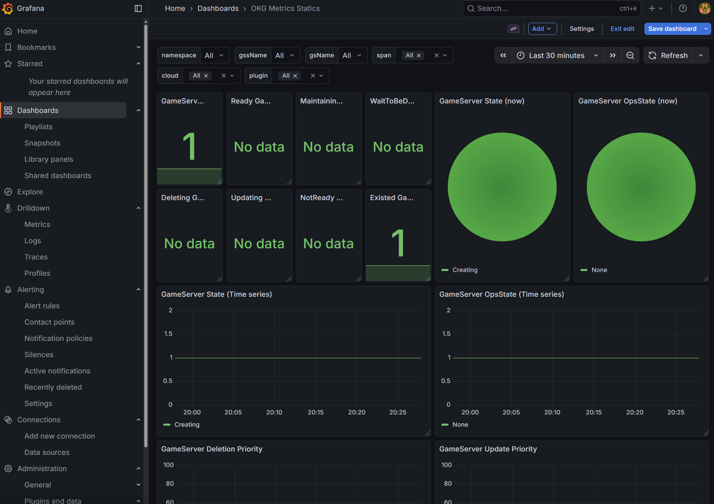
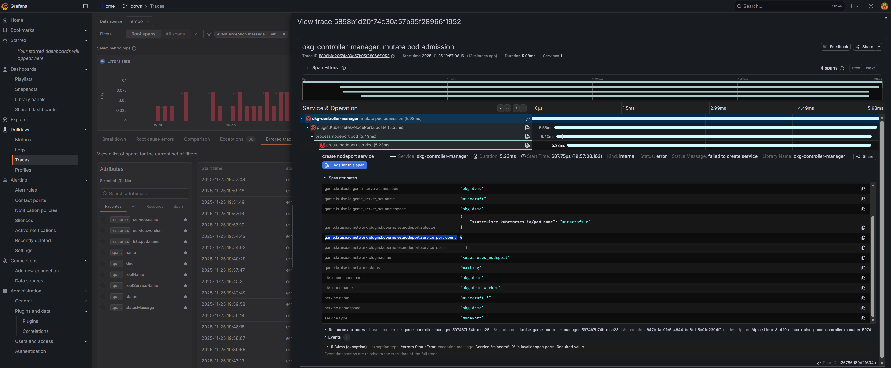
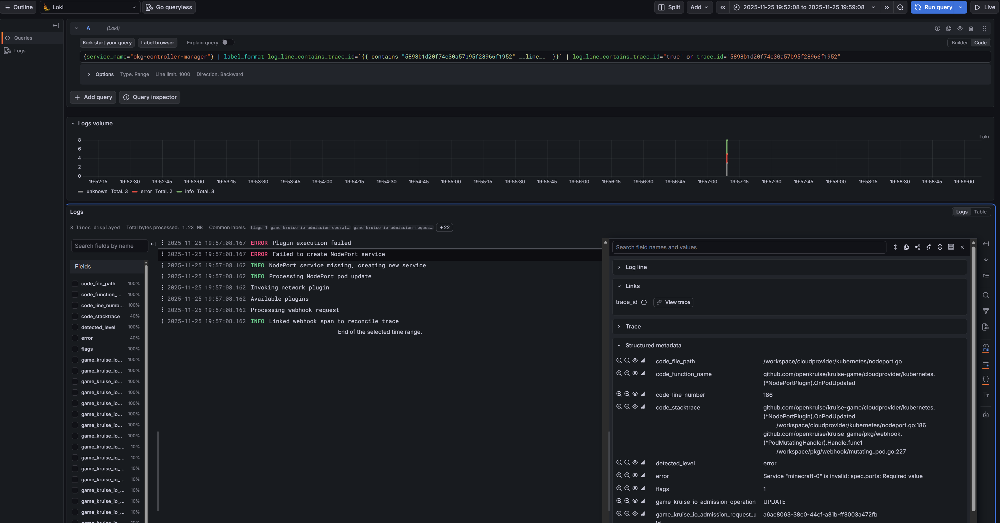
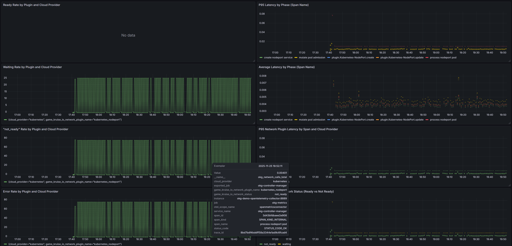

# Observability

This guide targets OpenKruiseGame operators (SRE, DevOps, platform engineers). It explains how to enable the OpenTelemetry pipeline, where each signal comes from, and how to read controller/network health from the exported data.

## Quick Start

The fastest way to experience OpenKruiseGame observability is with the **kruise-game-observability-demo** Helm chart. It deploys a complete, pre-configured stack in minutes:

```bash
# 1. Create a local cluster with multi-node support
kind create cluster --name okg-demo \
  --config charts/versions/kruise-game-observability-demo/0.1.0/kind-conf.yaml

# 2. Install the demo chart (idempotent, with dependency resolution)
cd charts/versions/kruise-game-observability-demo/0.1.0
helm upgrade --install okg-demo . \
  --namespace okg-demo --create-namespace \
  --wait --timeout 10m --dependency-update

# 3. Access Grafana (use the provided script)
./port-forward-grafana.sh
# Open http://localhost:3000 (admin/admin)
```

**What you get:**
- OpenKruise + KruiseGame controller (telemetry enabled)
- OpenTelemetry Collector (pre-configured pipelines)
- Prometheus, Loki, Tempo (local storage)
- Grafana with pre-loaded KruiseGame dashboards
- Demo Minecraft GameServerSet (generates controller reconciliation activity)

This zero-config setup lets you explore the full observability experience. Once you understand the value, you can migrate to production by:
1. Pointing the collector to your existing backends
2. Adjusting sampling rates and retention policies
3. Integrating with your alerting infrastructure

**Production handoff:**
- Replace demo endpoints with your own in the chart values (collector, Tempo/Loki/Prometheus remote write). Start from the upstream values file and override the sinks that matter in your environment: https://github.com/openkruise/charts/blob/main/charts/versions/kruise-game-observability-demo/0.1.0/values.yaml
- Keep `kruise-game.manager.otel.enabled=true`, set `kruise-game.manager.otel.endpoint` to your collector, and tune `kruise-game.manager.otel.samplingRate`.
- Point Grafana datasources to your production backends or reuse an existing Grafana instance. The demo stack is local-only; storage/creds are intentionally minimal and should be replaced before real use.

---

## 1. Enable the pipeline

The controller manager binary already contains log, trace, and metric instrumentation. You only need to:

1. Deploy an OpenTelemetry Collector (see §5). The **kruise-game-observability-demo** chart provides a ready-to-use stack; the manifests under `test/e2e/manifests` offer advanced configurations including Grafana Cloud dual-write for CI environments.
2. Pass the following flags to the `kruise-game-controller-manager` container:

   ```yaml
   - --enable-tracing=true                # enable span export + remote logs
   - --otel-collector-endpoint=otel-collector.observability.svc.cluster.local:4317
   - --otel-sampling-rate=1.0             # tune down only if needed
   - --log-format=json                    # <optional> set stdout/stderr log format
   ```
3. Make sure the Downward API injects namespace/pod metadata:

   ```yaml
         env:
           - name: POD_NAME
             valueFrom:
               fieldRef:
                 fieldPath: metadata.name
           - name: POD_NAMESPACE
             valueFrom:
               fieldRef:
                 fieldPath: metadata.namespace
           - name: POD_UID
             valueFrom:
               fieldRef:
                 fieldPath: metadata.uid
   ```
   These values are propagated to logs/traces/metrics as `service.*` and `k8s.*` attributes.

## 2. Logging

- `--log-format` controls only what you see in `kubectl logs` (`console` or `json`). The default is console.
- **OTLP bridge**: once `--otel-collector-endpoint` is set, the controller wraps the local zap core with a tee that forwards every log entry to `otelzap` before the console/JSON encoder runs. The collector therefore always receives fully structured OTLP logs—even when stdout stays in console mode—so Grafana/Loki keep the rich metadata without sacrificing human-readable pod logs.
- `logging.FromContextWithTrace(ctx)` is used across controllers/webhooks so every log emitted inside a span carries `trace_id` and `span_id`. Collectors (using the `transform/log_trace_labels` processor from §5) can therefore correlate log lines back to traces.


## 3. Distributed tracing

- Enable tracing with `--enable-tracing=true` and point to your collector via `--otel-collector-endpoint`.
- `--otel-sampling-rate` sets the `TraceIDRatioBased` sampler. Values between 0 and 1 are accepted; invalid values abort startup.
- Controllers emit spans for every `GameServer` and `GameServerSet` reconcile. Attributes include:
  - `game.kruise.io.game_server.name` / `.namespace`
  - `game.kruise.io.game_server_set.name`
  - `game.kruise.io.network.status` (e.g., `waiting`, `ready`, `error`)
- `GameServerManager` writes a `game.kruise.io/traceparent` annotation onto Pods. The admission webhook reads it, links its own span to the reconcile trace, and records the network plugin it invoked.
- Cloud provider plugins (Alibaba NLB, Kubernetes NodePort/HostPort) wrap every allocate/deallocate/service operation in spans so you can inspect latency or errors per plugin.

**Operational tips**

- Spans fall back to a no-op provider when OTLP dialing fails; the controller logs `Tracing initialization failed, using no-op tracer` in that case.
- Search for traces & logs by attributes like `game.kruise.io.game_server.name`, `game.kruise.io.network.plugin.name`, `cloud.provider`, or `k8s.namespace.name` (use `tracing.AttrK8sNamespaceName(ns)` or `telemetryfields.FieldK8sNamespaceName`), you can find them at `pkg/tracing/attributes.go`.

## 4. Metrics

### 4.1 Native controller metrics (`/metrics`)

These are registered in `pkg/metrics/prometheus_metrics.go` and exposed at the manager’s `--metrics-bind-address` (default `:8080`). Scrape them with Prometheus or the collector’s `prometheus/native` receiver.

| Metric | Type | Labels | What it tells you |
| --- | --- | --- | --- |
| `okg_gameservers_state_count` | Gauge | `state` | Live GameServer distribution across states. |
| `okg_gameservers_opsState_count` | Gauge | `opsState`, `gssName`, `namespace` | Number of GameServers in operational states. |
| `okg_gameservers_total` | Counter | – | Cumulative GameServers processed since controller start. |
| `okg_gameserversets_replicas_count` | Gauge | `gssName`, `gssNs`, `gsStatus` | Replica counts per GameServerSet broken down by GameServer status. |
| `okg_gameserver_deletion_priority` | Gauge | `gsName`, `gsNs` | Active deletion priority value for each GameServer. |
| `okg_gameserver_update_priority` | Gauge | `gsName`, `gsNs` | Update priority value. |
| `okg_gameserver_ready_duration_seconds` | Gauge | `gsName`, `gsNs`, `gssName` | Time from creation to `Ready`. |
| `okg_gameserver_network_ready_duration_seconds` | Gauge | `gsName`, `gsNs`, `gssName` | Time until `NetworkStatus.Ready`. Spikes indicate plugin issues. |

What you get out of the box (Grafana dashboard `OKG Metrics Statics`):
- Current GameServer counts by state/opsState (stat cards + pie + time series)
- Per-GameServer deletion/update priority
- GameServerSet replicas by status (current / available / maintaining / waitToBeDeleted)
- Network readiness duration (`okg_gameserver_network_ready_duration_seconds`) as a time series to spot spikes

Dashboard overview:  


### 4.2 Span-derived network metrics (`okg_network` namespace)

The collector’s spanmetrics connector emits `okg_network_*` metrics:

- `okg_network_calls_total` — counts spans by plugin/phase/status (the dashboard shows Ready/Waiting/NotReady/Error rates by plugin + cloud provider)
- `okg_network_latency_seconds_bucket` — latency histograms per span name (dashboard has avg/P95 by phase, by plugin + cloud provider, and by network status)
- Exemplars are enabled so you can jump from panels to traces.

Dashboard filters: namespace/gssName/gsName, span (phase), cloud_provider, network plugin. This makes it easy to slice by plugin or provider when investigating readiness drops or latency spikes.

Tip: Grafana Explore → Traces has built-in RED views (“Rate, Errors, Duration”) sourced from Tempo’s spanmetrics. They surface spans/sec, failing spans, and latency heatmaps for whatever span filters you apply—handy for spotting spikes before diving into full traces.

RED + exceptions view (Drilldown/Traces):  


## 5. Collector deployment

**Recommended:** Use the **kruise-game-observability-demo** Helm chart for the simplest setup. It bundles a pre-configured OTel Collector with all necessary pipelines.

**Advanced reference:** The `test/e2e/manifests` directory contains standalone manifests (namespace `observability`) with additional features for contributors and CI environments:

- `01-otel-collector.yaml`: local stack (Tempo/Loki/Prometheus inside the cluster).
- `01-otel-collector-grafana.yaml`: dual-write stack that mirrors everything to Grafana Cloud via OTLP / Prometheus Remote Write while keeping the local sinks.

The dual-write variant is particularly useful for debugging tests running on ephemeral CI runners, where local storage disappears after the job completes.

Two collector variants are available in the e2e manifests:

- **Receivers**:
  - OTLP gRPC/HTTP (`traces`, `logs`)
  - Prometheus scrape of the controller (`prometheus/native`)
  - `spanmetrics` connector (receives spans from `traces/network` pipeline and generates RED metrics)

- **Processors**:
  - `k8sattributes`: Injects `game.kruise.io.k8s.pod_ip`/`k8s.pod.uid` labels for all signals.
  - `transform/log_trace_labels`: Copies `trace_id`/`span_id` into log attributes so Loki can pivot back to traces.
  - `tail_sampling`: Keeps error/slow traces while sampling everything else probabilistically.
  - `filter/network_only`: Feeds only network plugin spans into the spanmetrics connector to avoid noise.

- **Pipelines**:
  - `traces/network` → `filter/network_only` → `spanmetrics connector` (Generates metrics)
  - `metrics/network` (Source: spanmetrics) → `prometheus/local` (:8889) + `prometheusremotewrite` (Cloud)
  - `metrics/native` (Source: controller :8080) → `prometheus/local` (:8889) + `prometheusremotewrite` (Cloud)
  - `traces/storage` → Tempo + Grafana Cloud
  - `logs` → Loki + Grafana Cloud

- **Exports**:
  - **Local (Pull)**: `prometheus/local` exposes **aggregated metrics** (both native and span-derived) on `:8889` for the local Prometheus to scrape.
  - **Local (Push)**: `otlp/tempo` and `otlphttp/loki` push directly to local storage backends.
  - **Cloud (Push)**: `otlphttp/grafana_cloud` and `prometheusremotewrite/grafana_cloud` push data to Grafana Cloud endpoints.
  - **Self-Monitoring**: The collector exposes its own telemetry on `:8888`.

```mermaid
graph LR
    classDef metrics fill:#e1f5fe,stroke:#01579b,stroke-width:2px;
    classDef traces fill:#fce4ec,stroke:#880e4f,stroke-width:2px;
    classDef logs fill:#e8f5e9,stroke:#1b5e20,stroke-width:2px;
    classDef store fill:#fff3e0,stroke:#e65100,stroke-width:2px,stroke-dasharray: 5 5;
    classDef cloud fill:#f3e5f5,stroke:#4a148c,stroke-width:2px,stroke-dasharray: 5 5;

    subgraph Sources [Telemetry Sources]
        direction TB
        CM[Controller Manager]
        CM_Metrics[Native Metrics :8080]:::metrics
        CM_Trace[OTLP Trace]:::traces
        CM_Log[OTLP Log]:::logs
        
        CM --> CM_Metrics
        CM --> CM_Trace
        CM --> CM_Log
    end

    subgraph Collector [OTel Collector]
        
        subgraph Receivers [Receivers]
            direction TB
            Receiver_Prom[Prometheus/Native]:::metrics
            Receiver_OTLP[OTLP Receiver]:::traces
        end

        subgraph Processors [Processors & Connectors]
            direction TB
            Processor_Filter[Filter: Network Only]:::traces
            Connector_SpanMetrics[Connector: SpanMetrics]:::metrics
        end
        
        subgraph Pipelines [Pipelines]
            direction TB
            Pipeline_Native[Metrics: Native]:::metrics
            Pipeline_Network[Metrics: Network]:::metrics
            Pipeline_Trace[Traces: Storage]:::traces
            Pipeline_Log[Logs]:::logs
        end

        subgraph Exporters [Exporters]
            direction TB
            Exporter_PromLocal[Prometheus Local :8889]:::metrics
            Exporter_RemoteWrite[Remote Write]:::metrics
            Exporter_Tempo[OTLP Tempo]:::traces
            Exporter_Loki[OTLP Loki]:::logs
            Exporter_CloudOTLP[OTLP Grafana]:::traces
        end
    end

    subgraph Storage [Storage Backends]
        direction TB
        
        subgraph Local_Cluster [Local Cluster]
            LocalProm[Local Prometheus]:::store
            Tempo[Tempo]:::store
            Loki[Loki]:::store
        end

        subgraph Cloud_Platform [Grafana Cloud]
            GC_Prom[Hosted Prometheus]:::cloud
            GC_OTLP[Hosted OTLP - Trace/Log]:::cloud
        end
    end

    %% 1. Sources -> Receivers
    CM_Metrics -->|Scrape| Receiver_Prom
    CM_Trace -->|gRPC| Receiver_OTLP
    CM_Log -->|gRPC| Receiver_OTLP

    %% 2. Receivers -> Pipelines / Processors
    Receiver_Prom --> Pipeline_Native
    Receiver_OTLP --> Pipeline_Trace
    Receiver_OTLP --> Pipeline_Log
    
    Receiver_OTLP --> Processor_Filter --> Connector_SpanMetrics
    Connector_SpanMetrics --> Pipeline_Network

    %% 3. Pipelines -> Exporters
    
    %% Metrics Flow
    Pipeline_Native --> Exporter_PromLocal
    Pipeline_Network --> Exporter_PromLocal
    Pipeline_Native --> Exporter_RemoteWrite
    Pipeline_Network --> Exporter_RemoteWrite

    %% Trace Flow
    Pipeline_Trace --> Exporter_Tempo
    Pipeline_Trace --> Exporter_CloudOTLP

    %% Log Flow
    Pipeline_Log --> Exporter_Loki
    Pipeline_Log --> Exporter_CloudOTLP

    %% 4. Exporters -> Storage
    Exporter_PromLocal -->|Scrape| LocalProm
    Exporter_RemoteWrite -->|Push| GC_Prom
    
    Exporter_Tempo -->|Push| Tempo
    Exporter_Loki -->|Push| Loki
    
    Exporter_CloudOTLP -->|Push| GC_OTLP
```



**Operational checklist**

1. `kubectl logs -n observability deploy/otel-collector` should show the health endpoint (`0.0.0.0:13133`) reporting `PASS`.
2. Prometheus must scrape both the controller service (`kruise-game-controller-manager-metrics-service:http-metrics`) and the collector’s `:8888`/`:8889` endpoints.
3. Ensure Tempo/Loki services are reachable from Grafana. Exemplars require Tempo + Prometheus 2.44+.


## 6. Troubleshooting

| Symptom | Checks |
| --- | --- |
| Logs missing from Loki | Confirm `--otel-collector-endpoint` is set, the collector pipeline (`transform/log_trace_labels`) is healthy, and there are no `otelzap` warnings about OTLP exporter failures. `--log-format` does not affect remote delivery. |
| No traces in Tempo | Confirm collector `traces/storage` pipeline is healthy and Tempo service reachable. |
| Spanmetrics empty | Confirm `game.kruise.io.network.plugin.name` attribute exists (look at a single trace). Validate `filter/network_only` processor isn’t excluding spans unintentionally. Prometheus must scrape `otel-collector:8889`. |
| Metrics endpoint missing | Ensure `--metrics-bind-address` is set (default `:8080`) and the Service `kruise-game-controller-manager-metrics-service` is pointing to it. |
| Network plugin slowness | Check `okg_gameserver_network_ready_duration_seconds` (controller) and corresponding spanmetrics histograms for the same timeframe. Use exemplars to correlate spikes with specific traces. |

Following this guide provides end-to-end visibility across controller reconciles, admission webhooks, and the cloud-provider networking layer with minimal configuration changes.


## 7. Diagnosis Scenarios (Cookbook)

This section demonstrates how to use the correlation between **Metrics**, **Traces**, and **Logs** to diagnose issues in OpenKruiseGame. The examples below are based on real scenarios discovered during development.

### Workflow Overview

The general diagnosis workflow is:

1. **Start with Metrics/Dashboard and Drilldown/Traces** → Identify anomalies (error spikes, latency increases)
2. **Drill Down via Exemplars** → Click the exemplar dot to jump to a specific trace
3. **Analyze Span Attributes** → Read structured fields to understand what happened
4. **Correlate with Logs** → Use `trace_id` to find related log entries
5. **Reach Conclusion** → Determine if it's a real issue or expected behavior

### Key Span Attributes Reference

When analyzing traces, these attributes provide diagnostic context:

| Attribute | Description |
|-----------|-------------|
| `game.kruise.io.game_server.name` | The GameServer being processed |
| `game.kruise.io.game_server_set.name` | Parent GameServerSet |
| `game.kruise.io.network.plugin.name` | Network plugin invoked (e.g., `kubernetes_hostport`) |
| `game.kruise.io.network.status` | Network state: `ready`, `not_ready`, `error`, `waiting` |
| `game.kruise.io.k8s.pod_ip` | Pod IP (empty if CNI hasn't assigned one yet) |
| `game.kruise.io.error.type` | Error category: `resource_not_ready`, `api_call_error`, etc. |

---

### Case study: NodePort service creation fails (api_call_error)

**Situation.** You start a local kind cluster using `charts/versions/kruise-game-observability-demo/0.1.0/kind-conf.yaml`, then install the demo chart with NodePort enabled but leave a HostPort-style network config (for example: `--set demoGameServer.network.type=Kubernetes-NodePort --set demoGameServer.network.containerPorts="minecraft:25565/TCP"`). The Helm install succeeds and the `minecraft-0` Pod is Running, but the Network status annotation stays `NotReady` and the dashboard shows NotReady spikes for the `kubernetes_nodeport` plugin.

**What you see in Grafana.** On the Network panels, exemplar dots appear over the NotReady rate. Clicking one opens a trace in Tempo where the `create nodeport service` span is red: `service.type=NodePort`, `service.name=minecraft-0`, `service_port_count=0`, and an exception message from the API server: `Service "minecraft-0" is invalid: spec.ports: Required value`. Opening “Logs for this span” shows the same error emitted from the webhook, correlated by `trace_id`.

Trace view (red span) and correlated structured logs:  
  


**Interpretation.** The pod is healthy and the cluster is fine; the problem is that the chart rendered a NodePort Service with zero ports. From the trace you can immediately see that:
- the failing component is the Kubernetes NodePort network plugin;
- the resource in question is the `minecraft-0` Service;
- the failure is a validation error on `spec.ports`, not a CNI, node, or cloud-provider issue.

**Resolution.** Adjust the demo chart values so the NodePort configuration produces a valid port list (or remove conflicting Services with the same name). After the next reconcile, the NodePort Service is created with ports, Network status becomes `Ready`, and the NotReady rate on the dashboard drops back to normal.

Network NotReady spikes before the fix:  


For transient/benign patterns (CNI race, informer cache fast-fail, etc.) and guidance on adjusting error levels, see the contributor-facing design notes in `observability-design.md`.
