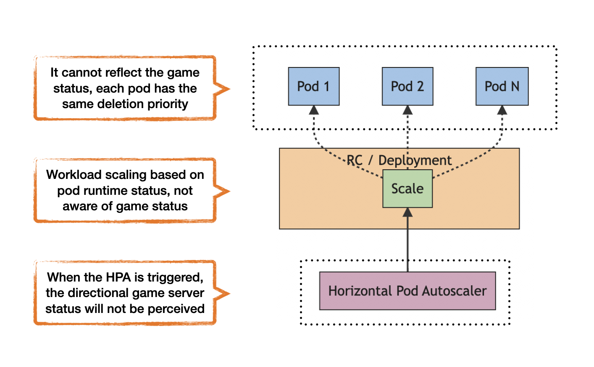
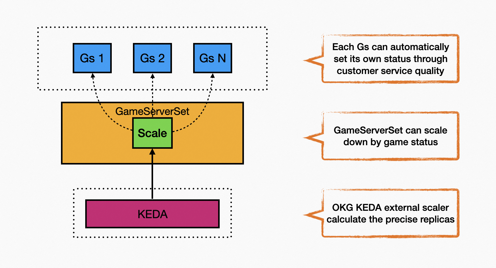

## Feature overview

Compared to stateless service types, game servers have higher requirements for automatic scaling, especially in terms of scaling down.

The differences between game servers become more and more obvious over time, and the precision requirements for scaling down are extremely high. Coarse-grained scaling mechanisms can easily cause negative effects such as player disconnections, resulting in huge losses for the business.

The horizontal scaling mechanism in native Kubernetes is shown in the following figure:



In the game scenario, its main problems are:

- At the pod level, it is unable to perceive the game server game status and therefore cannot set deletion priority based on game status.
- At the workload level, it cannot select scaling-down objects based on game status.
- At the autoscaler level, it cannot accurately calculate the appropriate number of replicas based on the game server game status.

In this way, the automatic scaling mechanism based on native Kubernetes will cause two major problems in the game scenario:

- The number of scaling down is not accurate. It is easy to delete too many or too few game servers.
- The scaling-down object is not accurate. It is easy to delete game servers with high game load levels.


The automatic scaling mechanism of OKG is shown in the following figure:



- At the game server level, each game server can report its own status and expose whether it is in the WaitToBeDeleted state through custom service quality or external components.
- At the workload level, the GameServerSet can determine the scaling-down object based on the business status reported by the game server. As described in Game Server Horizontal Scaling, the game server in the WaitToBeDeleted state is the highest priority game server to be deleted during scaling down.
- At the autoscaler level, accurately calculate the number of game servers in the WaitToBeDeleted state, and use it as the scaling-down quantity to avoid accidental deletion.

In this way, OKG's automatic scaler will only delete game servers in the WaitToBeDeleted state during the scaling-down window, achieving targeted and precise scaling down.

## Usage Example

_**Prerequisites: Install [KEDA](https://keda.sh/docs/2.10/deploy/) in the cluster.**_

Deploy the ScaledObject object to set the automatic scaling strategy. Refer to the [ScaledObject API](https://github.com/kedacore/keda/blob/main/apis/keda/v1alpha1/scaledobject_types.go) for the specific field meanings.

```yaml
apiVersion: keda.sh/v1alpha1
kind: ScaledObject
metadata:
  name: minecraft # Fill in the name of the corresponding GameServerSet
spec:
  scaleTargetRef:
    name: minecraft # Fill in the name of the corresponding GameServerSet
    apiVersion: game.kruise.io/v1alpha1 
    kind: GameServerSet
  pollingInterval: 30
  minReplicaCount: 0
  advanced:
    horizontalPodAutoscalerConfig: 
      behavior: # Inherit from HPA behavior, refer to https://kubernetes.io/zh-cn/docs/tasks/run-application/horizontal-pod-autoscale/#configurable-scaling-behavior
        scaleDown:
          stabilizationWindowSeconds: 45 # Set the scaling-down stabilization window time to 45 seconds
          policies:
            - type: Percent
              value: 100
              periodSeconds: 15
  triggers:
    - type: external
      metricType: Value
      metadata:
        scalerAddress: kruise-game-external-scaler.kruise-game-system:6000

```

After deployment, change the opsState of the gs minecraft-0 to WaitToBeDeleted (see [Custom Service Quality](service_qualities.md) for automated setting of game server status).

```bash
kubectl edit gs minecraft-0

...
spec:
  deletionPriority: 0 
  opsState: WaitToBeDeleted # Set to None initially, and change it to WaitToBeDeleted
  updatePriority: 0
...

```

After the scaling-down window period, the game server minecraft-0 is automatically deleted.

```bash
kubectl get gs
NAME          STATE      OPSSTATE          DP    UP
minecraft-0   Deleting   WaitToBeDeleted   0     0
minecraft-1   Ready      None              0     0
minecraft-2   Ready      None              0     0

# After a while
...

kubectl get gs
NAME          STATE   OPSSTATE   DP    UP
minecraft-1   Ready   None       0     0
minecraft-2   Ready   None       0     0

```