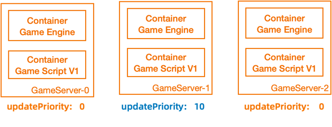

## Feature overview

OpenKruiseGame provides multiple update policies, including in-place update (used to implement [hot update](../getting_started/)), batch update, and update by priority.

You can set the updatePriority and partition parameters to control the update scope, sequence, and pace in actual production scenarios.
As shown in the following figure, if you raise the priority of GameServer-1 and set the partition parameter to 2, GameServer-1 is updated first. Then, if you change the value of the partition parameter to 0, the remaining game servers are updated. For more information, see the following example.



## Example

A group of game servers are updated in two batches to simulate a canary update.

The GameServerSet consists of three game server replicas.
```shell
kubectl get gs
NAME        STATE      OPSSTATE   DP    UP
gs-demo-0   Ready      None       0     0
gs-demo-1   Ready      None       0     0
gs-demo-2   Ready      None       0     0
```

Set the updatePriority parameter to a greater value for the game server gs-demo-1.
```shell
kubectl edit gs gs-demo-1

...
spec:
  deletionPriority: 0
  opsState: None
  updatePriority: 10 # The initial value is 0. Change the value to 10.
...
```

Set the partition parameter and the latest image used to trigger an update operation.
```shell
kubectl edit gss gs-demo

...
        image: gameserver:latest # Set the latest image.
        name: gameserver
...
  updateStrategy:
    rollingUpdate:
      maxUnavailable: 5
      partition: 2 # Set the number of game servers that do not need to be updated to 2 because only one game server needs to be updated.
      podUpdatePolicy: InPlaceIfPossible
...

```

In this case, only the game server gs-demo-1 is updated.
```shell
kubectl get gs
NAME        STATE      OPSSTATE   DP    UP
gs-demo-0   Ready      None       0     0
gs-demo-1   Updating   None       0     10
gs-demo-2   Ready      None       0     0


# Wait for a period of time.
...

kubectl get gs
NAME        STATE      OPSSTATE   DP    UP
gs-demo-0   Ready      None       0     0
gs-demo-1   Ready      None       0     10
gs-demo-2   Ready      None       0     0
```

After you verify that the game server gs-demo-1 is updated, update the remaining game servers.
```shell
kubectl edit gss gs-demo
...
  updateStrategy:
    rollingUpdate:
      maxUnavailable: 5
      partition: 0 # Set the number of game servers that do not need to be updated to 0 to update all the remaining game servers.
      podUpdatePolicy: InPlaceIfPossible
...

```

