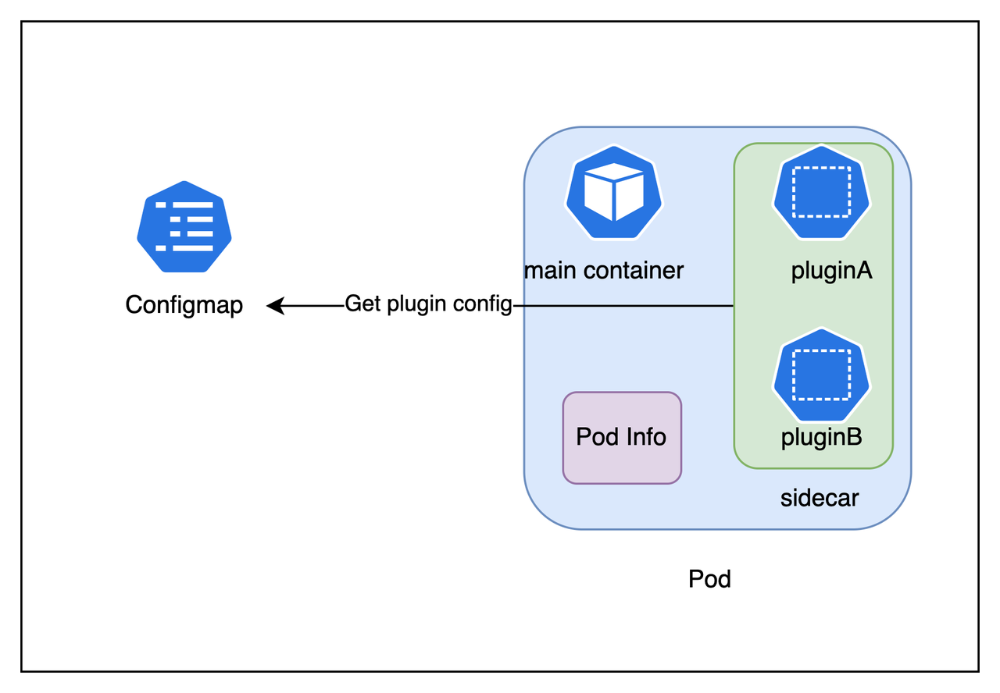
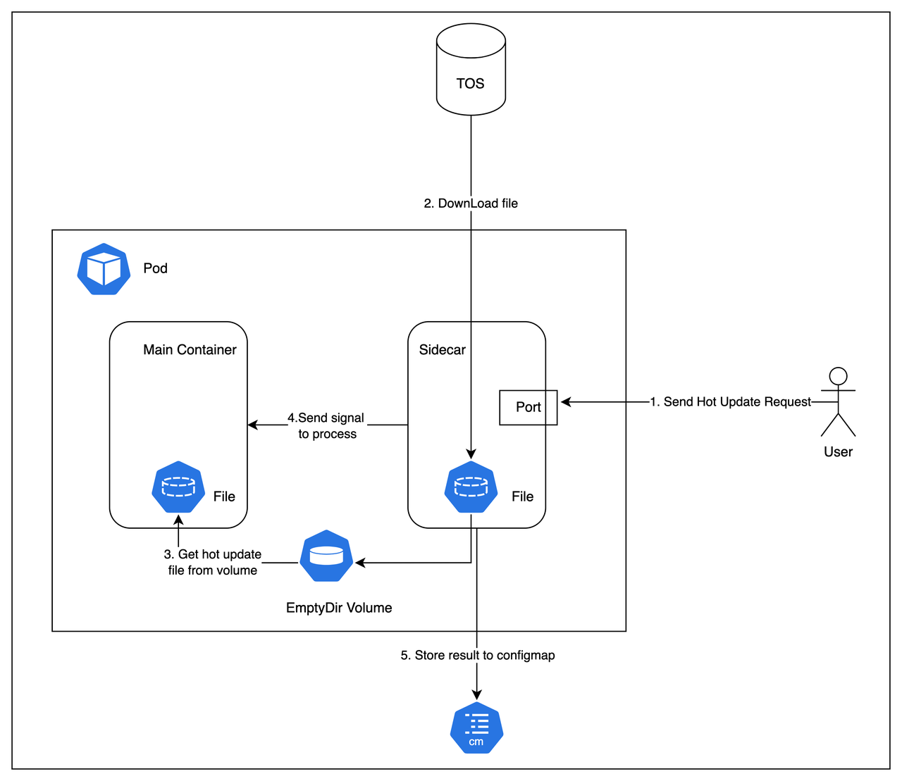
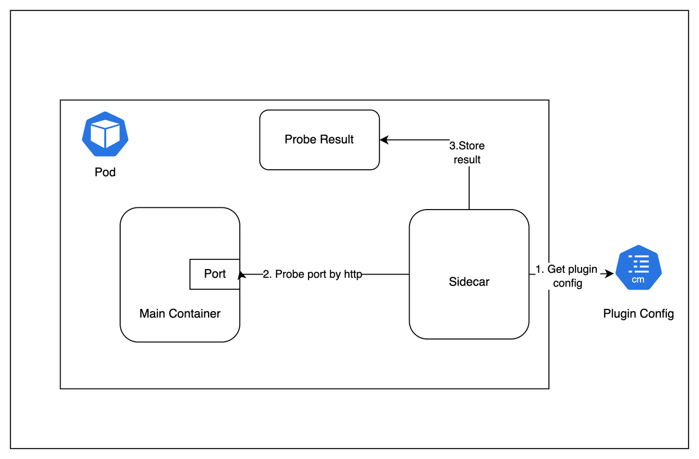

# Title

- 增加sidecar解决serverless场景下问题

## 目录
* [Title](#title)
  * [目录](#目录)
  * [背景](#背景)
  * [方案详解](#方案详解)
    * [sidecar管理](#sidecar管理)
      * [设计架构](#设计架构)
      * [plugin接口设计：设计了一套plugin接入接口，新增的plugin通过这套接口纳入管理；](#plugin接口设计设计了一套plugin接入接口新增的plugin通过这套接口纳入管理)
    * [实现过程](#实现过程)
  * [热更新](#热更新)
    * [设计架构](#设计架构-1)
    * [实现过程](#实现过程-1)
  * [服务质量探测](#服务质量探测)
    * [设计架构](#设计架构-2)
    * [实现过程](#实现过程-2)
  * [Demo](#demo)
    * [热更新](#热更新-1)
    * [服务质量探测](#服务质量探测-1)


## 背景
通过sidecar plugin机制，实现游戏场景 serverless下的增强功能，将该机制放到OKG社区，提供OKG在serverless场景下的解决方案。

## 方案详解

### sidecar管理

#### 设计架构
<p align="center">
  
</p>

- Sidecar 内部接口设计: sidecar内部设计了一系列接口，用于管理抽象化的plugin

| 接口名称 | 作用 |
| --- | --- |
| `InitPlugins() error` | 初始化所有plugin |
| `AddPlugin(name string, config interface{})` | 添加指定plugin |
| `GetConfigType()` | 获取plugin需要的配置 |
| `Init()` | 对plugin进行初始化 |
| `RemovePlugin(pluginName string) error` | 移除指定plugin |
| `GetVersion() string` | 获取版本号 |
| `PluginStatus(pluginName string) (*PluginStatus, error)` | 获取指定plugin状态 |
| `Start(ctx context.Context) error` | 开启所有plugin |
| `Stop(ctx context.Context) error` | 停止所有plugin |
| `SetupWithManager(mgr SidecarManager) error` | 启动manager |
| `LoadConfig(path string) error` | 加载配置 |
| `StoreData(factory StorageFactory, data string) error` | 存储plugin结果 |

#### plugin接口设计：设计了一套plugin接入接口，新增的plugin通过这套接口纳入管理；

| 接口名称 | 作用 |
| --- | --- |
| `Name()` | 获取plugin名称 |
| `Init()` | 初始化plugin |
| `Start()` | 运行plugin，实现具体逻辑 |
| `Stop()` | 停止plugin |
| `Version()` | 获取plugin版本 |
| `Status()` | 获取plugin状态 |
| `GetConfigType()` | 获取plugin配置类型 |

### 实现过程
- 启动sidecar
- 从configmap中加载sidecar配置
- 添加plugin
- 初始化plugin
- 启动plugin
  - plugin循环运行自身逻辑
  - plugin保存运行结果
  - 更新自身状态
- 启动健康检查服务

## 热更新

### 设计架构
<p align="center">
  
</p>

- 运行过程：
  - 用户调用指定pod的sidecar容器端口，触发sidecar容器到远端拉取新的配置文件；
  - 拉取到新的配置文件后，主容器通过共享挂载的方式获取到新的配置文件；
  - sidecar向主容器中指定进程发送信号量，触发其读取新的配置文件；
  - sidecar将热更新结果写到configmap中，进行持久化；

### 实现过程
- hot-update配置信息
```yaml
apiVersion: v1
kind: ConfigMap
metadata:
  name: sidecar-config
  namespace: sidecar
data:
  config.yaml: |
    plugins:
      - name: hot_update
        config:
          loadPatchType: signal # 通过信号量的方式触发热更新
          signal:
            processName: 'nginx: master process nginx' ## 触发主进程热更新的进程名称
            signalName: SIGHUP ## 触发主进程热更新时，需要的发送的信号量
          storageConfig:
            inKube:
              annotationKey: sidecar.vke.volcengine.com/hot-update-result # 将热更新结果保存到pod的哪个anno中
            type: InKube
        bootorder: 0
    restartpolicy: Always
    resources:
      CPU: 100m
      Memory: 128Mi
    sidecarstartorder: Before ## Sidecar 的启动顺序，是在主容器之后还是之前
```
- plugin初始化过程 
  - 校验config的合法性
- plugin运行过程 
  - 启动一个http服务，用于接收触发热更新的请求，监听的路径为/hot-update，端口为5000
    - 触发热更新时，只需要向需要热更新的pod发送http请求即可，需要在请求中带上热更新版本号以及热更新文件地址；
      ```bash
      curl -k -X POST -d "version=v1&url=https://xxx.com/2048/v2/index.html" http://xxxx:5000/hot-update
      ``` 
  - plugin接收到热更新请求时，从请求中获取版本号以及配置文件地址，根据配置文件地址下载最新配置文件，并且保存到sidecar中；
  - plugin向游戏服主容器指定进程发送信号量，触发游戏服主容器加载新的配置文件
    - 进程信息，信号量通过plugin config中获取；
  - 将热更新结果，版本号，配置文件地址进行持久化保存，保存到两个地方
    - 在当前pod的anno中，保存热更新版本号以及是否更新成功；
      - 具体保存到pod的哪个anno，可以在plugin config中获取；
    - 存储到结果保存的configmap中，保存热更新版本，配置文件地址，用来做pod容灾恢复；当pod重启时，可以从该configmap中获取到重启前pod的热更新版本和配置文件地址，保证重启后的pod仍然能获取到最新配置；


## 服务质量探测

### 设计架构
<p align="center">
  
</p>

- 运行过程：
  - 用户调用指定pod的sidecar容器端口，触发sidecar容器到远端拉取新的配置文件；
  - 拉取到新的配置文件后，主容器通过共享挂载的方式获取到新的配置文件；
  - sidecar向主容器中指定进程发送信号量，触发其读取新的配置文件；
  - sidecar将热更新结果写到configmap中，进行持久化；

### 实现过程
- probe 配置信息
```yaml
apiVersion: v1
kind: ConfigMap
metadata:
  name: sidecar-config
  namespace: sidecar
data:
  config.yaml: |
    plugins:
      - name: http_probe
        config:
          endpoints:
            - expectedStatusCode: 200 ## 代表探测成功的状态码
              method: GET # http请求方法
              storageConfig: # 结果保存配置
                inKube:
                  markerPolices: # 结果保存规则：请求结果为WaitToBeDeleted时，gameserver中的spec.opsState设置为WaitToBeDeleted
                    - gameServerOpsState: WaitToBeDeleted
                      state: WaitToBeDeleted 
                    - gameServerOpsState: Allocated
                      state: Allocated
                    - gameServerOpsState: None
                      state: None
                type: InKube
              timeout: 30  # 探测超时时间 s
              url: http://localhost:8080 # http探测地址
          startDelaySeconds: 10 # 探测的启动延迟 s
          probeIntervalSeconds: 5 # 探测时间间隔 s
        bootorder: 1
    restartpolicy: Always
    resources:
      CPU: 100m
      Memory: 128Mi
    sidecarstartorder: Before ## Sidecar 的启动顺序，是在主容器之后还是之前
```
- plugin初始化过程
  - 校验config的合法性：
    - 探测时间间隔是否大于0
    - 延迟启动时间是否大于0

- plugin运行过程
  - 根据设置的延迟启动时间，延迟启动
  - 根据设置的探测地址进行循环探测，循环探测的间隔从config中获取；
    - 读取探测地址中的http methor/url/header
    - 对指定地址探测
    - 获取探测结果
    - 根据探测结果，修改gameserver的spec.opsState的状态，具体规则在configmap中定义；

## Demo
- config的yaml
```yaml
apiVersion: v1
kind: ConfigMap
metadata:
  name: sidecar-config
  namespace: sidecar
data:
  config.yaml: |
    plugins:
      - name: http_probe
        config:
          endpoints:
            - expectedStatusCode: 200
              method: GET
              storageConfig:
                inKube:
                  markerPolices:
                    - gameServerOpsState: WaitToBeDeleted
                      state: WaitToBeDeleted
                    - gameServerOpsState: Allocated
                      state: Allocated
                    - gameServerOpsState: None
                      state: None
                type: InKube
              timeout: 30
              url: http://localhost:8080
          startDelaySeconds: 60
        bootorder: 1
      - name: hot_update
        config:
          loadPatchType: signal # 通过信号量的方式触发热更新
          signal:
            processName: 'nginx: master process nginx' ## 触发主进程热更新的进程名称
            signalName: SIGHUP ## 触发主进程热更新时，需要的发送的信号量
          storageConfig:
            inKube:
              annotationKey: sidecar.vke.volcengine.com/hot-update-result # 将热更新结果保存到pod的哪个anno中
            type: InKube
        bootorder: 0
    restartpolicy: Always
    resources:
      CPU: 100m
      Memory: 128Mi
    sidecarstartorder: Before ## Sidecar 的启动顺序，是在主容器之后还是之前
```
### 热更新
```yaml
apiVersion: game.kruise.io/v1alpha1
kind: GameServerSet
metadata:
  name: hot-update-gs
  namespace: default
spec:
  replicas: 2
  updateStrategy:
    rollingUpdate:
      podUpdatePolicy: InPlaceIfPossible
  network:
    networkType: Volcengine-CLB
    networkConf:
      - name: ClbIds
        #填写已经创建好的clb ID
        value: clb-xxx
      - name: PortProtocols
        # 填写pod暴露的端口及协议，支持填写多个端口/协议
        # 填写格式：port1/protocol1,port2/protocol2,...（协议需大写）
        value: 14004/TCP,8080/TCP
      - name: Fixed
        #是否固定访问IP/端口。若是，即使pod删除重建，网络内外映射关系不会改变
        value: "false"
        #自定义的anno
      - name: Annotations
        value: "service.beta.kubernetes.io/volcengine-loadbalancer-pass-through:true,service.beta.kubernetes.io/volcengine-loadbalancer-scheduler:wrr,service.beta.kubernetes.io/volcengine-loadbalancer-healthy-threshold:3"
  gameServerTemplate:
    metadata:
      annotations:
        vke.volcengine.com/burst-to-vci: enforce
      labels:
        app: hot-update-gs
    spec:
      # 添加一个InitContainers检测clb是否分配成功，绑定成功后才启动主容器，
      # 保证主容器启动时pod的clb和端口已经分配成功
      initContainers:
        - command:
            - timeout
            - "60"
            - sh
            - -c
            - until grep -i 'externalAddress' /etc/ipinfo/allocated-ip; do echo waiting
              for allocated-ip; sleep 1; done
          image: cr-helm2-cn-beijing.cr.volces.com/perf/busybox:latest
          imagePullPolicy: Always
          name: init
          resources: {}
          terminationMessagePath: /dev/termination-log
          terminationMessagePolicy: File
          # 将外部访问地址和端口挂载到容器内的/etc/ipinfo中
          volumeMounts:
            - mountPath: /etc/ipinfo
              name: ipinfo
      restartPolicy: Always
      schedulerName: default-scheduler
      securityContext: {}
      serviceAccountName: sidecar-sa
      terminationGracePeriodSeconds: 30
      shareProcessNamespace: true
      containers:
        - image: 2048
          name: game-2048
          ports:
            - containerPort: 80
              name: game
              protocol: TCP
          terminationMessagePath: /dev/termination-log
          terminationMessagePolicy: File
          # 将外部访问地址和端口挂载到容器内的/etc/ipinfo中
          volumeMounts:
            - mountPath: /etc/ipinfo
              name: ipinfo
            - mountPath: /var/www/html
              name: share-data # 持久化存储共享目录
        - image: okg-sidecar:v1
          imagePullPolicy: Always
          name: sidecar
          env:
           - name: POD_NAME
             valueFrom:
               fieldRef:
                 apiVersion: v1
                 fieldPath: metadata.name
           - name: POD_NAMESPACE
             valueFrom:
               fieldRef:
                 apiVersion: v1
                 fieldPath: metadata.namespace
          ports:
            - containerPort: 5000
              name: hot-update-port
              protocol: TCP
            - containerPort: 80
              name: game
              protocol: TCP
          terminationMessagePath: /dev/termination-log
          terminationMessagePolicy: File
          # 将外部访问地址和端口挂载到容器内的/etc/ipinfo中
          volumeMounts:
            - mountPath: /opt/sidecar
              name: sidecar-config
            - mountPath: /app/downloads
              name: share-data # 持久化存储共享目录    
      dnsPolicy: ClusterFirst
      volumes:
        # 游戏服pod的anno中game.kruise.io/network-status中记录了pod的访问地址和端口，
        # 其中externalAddresses为外部访问地址和端口。
        - downwardAPI:
            defaultMode: 420
            items:
              - fieldRef:
                  apiVersion: v1
                  fieldPath: metadata.annotations['game.kruise.io/network-status']
                path: allocated-ip
          name: ipinfo
        - emptyDir: {}
          name: share-data
        - configMap:
            defaultMode: 420
            name: sidecar-config
          name: sidecar-config
---
apiVersion: v1
kind: ConfigMap
metadata:
  name: sidecar-result
  namespace: kube-system
---
apiVersion: rbac.authorization.k8s.io/v1
kind: ClusterRole
metadata:
  name: sidecar-role
rules:
  - apiGroups:
      - ""
    resources:
      - pods
      - configmaps
    verbs:
      - create
      - delete
      - get
      - list
      - patch
      - update
      - watch
---
apiVersion: v1
kind: ServiceAccount
metadata:
  name: sidecar-sa       # 为你的pod设置serviceAccount名字
---
apiVersion: rbac.authorization.k8s.io/v1
kind: ClusterRoleBinding
metadata:
  name: sidecar-rolebinding
roleRef:
  apiGroup: rbac.authorization.k8s.io
  kind: ClusterRole
  name: sidecar-role
subjects:
  - kind: ServiceAccount
    name: sidecar-sa
    namespace: default
```

### 服务质量探测
```yaml
apiVersion: game.kruise.io/v1alpha1
kind: GameServerSet
metadata:
  name: hot-update-gs
  namespace: sidecar
spec:
  replicas: 2
  updateStrategy:
    rollingUpdate:
      podUpdatePolicy: InPlaceIfPossible
  network:
    networkType: Volcengine-CLB
    networkConf:
      - name: ClbIds
        #填写已经创建好的clb ID
        value: clb-rqxxxxx
      - name: PortProtocols
        # 填写pod暴露的端口及协议，支持填写多个端口/协议
        # 填写格式：port1/protocol1,port2/protocol2,...（协议需大写）
        value: 3478/TCP
      - name: Fixed
        #是否固定访问IP/端口。若是，即使pod删除重建，网络内外映射关系不会改变
        value: "false"
        #自定义的anno
      - name: Annotations
        value: "service.beta.kubernetes.io/volcengine-loadbalancer-pass-through:true,service.beta.kubernetes.io/volcengine-loadbalancer-scheduler:wrr,service.beta.kubernetes.io/volcengine-loadbalancer-healthy-threshold:3"
  gameServerTemplate:
    metadata:
      annotations:
        vke.volcengine.com/burst-to-vci: enforce
      labels:
        app: hot-update-gs
    spec:
      # 添加一个InitContainers检测clb是否分配成功，绑定成功后才启动主容器，
      # 保证主容器启动时pod的clb和端口已经分配成功
      
      restartPolicy: Always
      schedulerName: default-scheduler
      securityContext: {}
      serviceAccountName: sidecar-sa
      terminationGracePeriodSeconds: 30
      shareProcessNamespace: true
      containers:
        - image: tank:latest
          name: tankwar
          env:
            - name: DEBUG
              value: ts-mp:*
          resources:
            limits:
              cpu: 1500m
              memory: 3000Mi
            requests:
              cpu: 1500m
              memory: 3000Mi
        - image: okg-sidecar:v1
          imagePullPolicy: Always
          name: sidecar
          env:
            - name: POD_NAME
              valueFrom:
                fieldRef:
                  apiVersion: v1
                  fieldPath: metadata.name
            - name: POD_NAMESPACE
              valueFrom:
                fieldRef:
                  apiVersion: v1
                  fieldPath: metadata.namespace
          ports:
            - containerPort: 5000
              name: hot-update-port
              protocol: TCP
          terminationMessagePath: /dev/termination-log
          terminationMessagePolicy: File
          # 将外部访问地址和端口挂载到容器内的/etc/ipinfo中
          volumeMounts:
            - mountPath: /opt/sidecar
              name: sidecar-config
            - mountPath: /app/downloads
              name: share-data # 持久化存储共享目录
      dnsPolicy: ClusterFirst
      volumes:
        # 游戏服pod的anno中game.kruise.io/network-status中记录了pod的访问地址和端口，
        # 其中externalAddresses为外部访问地址和端口。
        - downwardAPI:
            defaultMode: 420
            items:
              - fieldRef:
                  apiVersion: v1
                  fieldPath: metadata.annotations['game.kruise.io/network-status']
                path: allocated-ip
          name: ipinfo
        - emptyDir: {}
          name: share-data
        - configMap:
            defaultMode: 420
            name: sidecar-config
            namespace: sidecar
          name: sidecar-config
---
apiVersion: v1
kind: ConfigMap
metadata:
  name: sidecar-result
  namespace: kube-system
---
apiVersion: rbac.authorization.k8s.io/v1
kind: ClusterRole
metadata:
  name: sidecar-role
rules:
  - apiGroups:
      - ""
    resources:
      - pods
      - configmaps
    verbs:
      - create
      - delete
      - get
      - list
      - patch
      - update
      - watch
  - apiGroups:
      - "game.kruise.io"
    resources:
      - '*'
    verbs:
      - patch
      - update
---
apiVersion: v1
kind: ServiceAccount
metadata:
  name: sidecar-sa       # 为你的pod设置serviceAccount名字
  namespace: sidecar
---
apiVersion: rbac.authorization.k8s.io/v1
kind: ClusterRoleBinding
metadata:
  name: sidecar-rolebinding
roleRef:
  apiGroup: rbac.authorization.k8s.io
  kind: ClusterRole
  name: sidecar-role
subjects:
  - kind: ServiceAccount
    name: sidecar-sa
    namespace: sidecar
```

