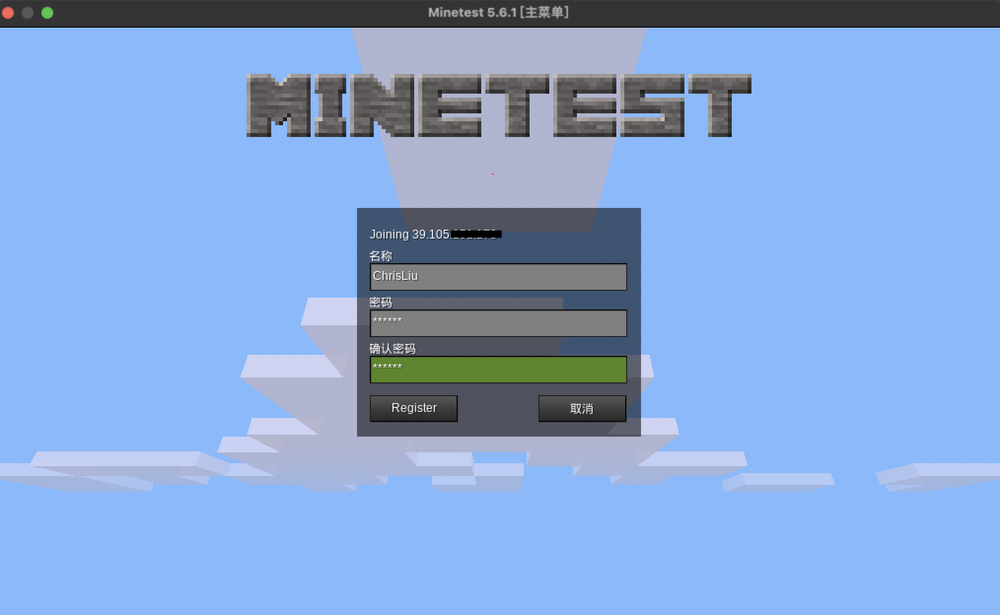
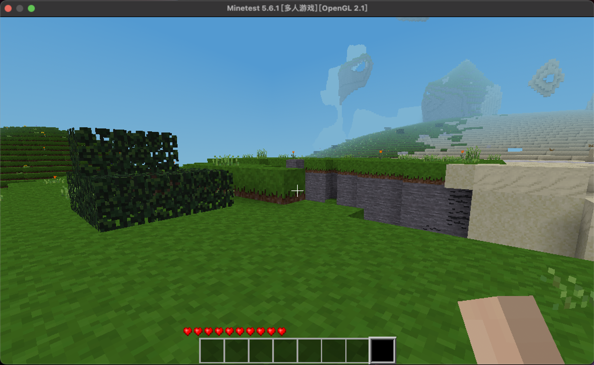

## PvE游戏

PvE是指玩家对战环境。在PvE游戏中，玩家会在开放世界中穿梭不同场景，以个人或者与其他玩家组队的方式和环境（npc/boss）交互。

PvE游戏特点：

- 尽管逻辑相同，但不同游戏服之间的配置大多有所差异。
- 游戏服生命周期较长，开服后除更新外不轻易停机。
- 随着时间推移，各个游戏服差异性逐渐明显，例如玩家数量、服务状态等。

OpenKruiseGame(OKG) 为PvE游戏提供的能力：

- 支持批量部署差异配置的游戏服。
- 支持包括热更新在内的多种更新策略，避免不必要的停服动作、并尽可能地提高更新效率。
- 支持游戏服的定向管理，对指定游戏服进行维护、下线、网络隔离等操作。

## 游戏案例

[minetest](https://github.com/minetest/minetest) 是一款开源沙盒类游戏，在这里使用minetest为大家演示如何利用OKG部署PvE游戏。

### 一键式部署

网络方面使用HostPort暴露游戏服务，部署了三个游戏服。

```bash
cat <<EOF | kubectl apply -f -
apiVersion: game.kruise.io/v1alpha1
kind: GameServerSet
metadata:
  name: mintest
  namespace: default
spec:
  replicas: 3
  updateStrategy:
    rollingUpdate:
      podUpdatePolicy: InPlaceIfPossible
  network:
    networkType: Kubernetes-HostPort
    networkConf:
      - name: ContainerPorts
        value: gameserver:30000/UDP
  gameServerTemplate:
    spec:
      containers:
        - image: registry.gitlab.com/minetest/minetest/server:latest
          name: gameserver
EOF
```
等待一会后，三个游戏服全部Ready

```bash
kubectl get gs
NAME        STATE   OPSSTATE   DP    UP
mintest-0   Ready   None       0     0
mintest-1   Ready   None       0     0
mintest-2   Ready   None       0     0
```

查看mintest-1的网络信息

```bash
kubectl get gs mintest-1 -oyaml
...
status:
  networkStatus:
    createTime: "2022-12-08T11:28:29Z"
    currentNetworkState: Ready
    desiredNetworkState: Ready
    externalAddresses:
    - ip: 39.105.xxx.xxx
      ports:
      - name: gameserver-30000
        port: 8854
        protocol: UDP
    internalAddresses:
    - ip: 172.16.0.16
      ports:
      - name: gameserver-30000
        port: 30000
        protocol: UDP
    lastTransitionTime: "2022-12-08T11:28:29Z"
    networkType: Kubernetes-HostPort
...
```

打开minetest客户端，输入对应服务IP端口，准备连接



玩家顺利进入游戏



通过视频观看部署过程：[使用OpenKruiseGame快速部署minetest(PvE)游戏](https://www.bilibili.com/video/BV1sR4y1k7vq/?spm_id_from=333.999.list.card_archive.click&vd_source=8712d530f28d3cbc03eba5b378b88a7a)

### 定向下线

尽管使用workload批量管理了游戏服，但OKG支持对游戏服的定向下线。例如，我们下线mintest-1游戏服：

```
kubectl edit gss mintest

...
spec:
  replicas: 2 #副本数量减少1, 调整到2个
  reserveGameServerIds: 
  - 1 #指定序号1
...
```

观察集群中游戏服变化情况，最终游戏服1下线，剩下0和2

```bash
kubectl get gs
NAME        STATE      OPSSTATE   DP    UP
mintest-0   Ready      None       0     0
mintest-1   Deleting   None       0     0
mintest-2   Ready      None       0     0

# 过了一会后

kubectl get gs
NAME        STATE   OPSSTATE   DP    UP
mintest-0   Ready   None       0     0
mintest-2   Ready   None       0     0

```

接下来，或许你还需要：

- [游戏服热更新](../快速开始/游戏服热更新.md)
- [游戏服更新策略](../用户手册/游戏服更新策略.md)
- [自定义服务质量](../用户手册/自定义服务质量.md)
- [网络模型](../用户手册/网络模型.md)