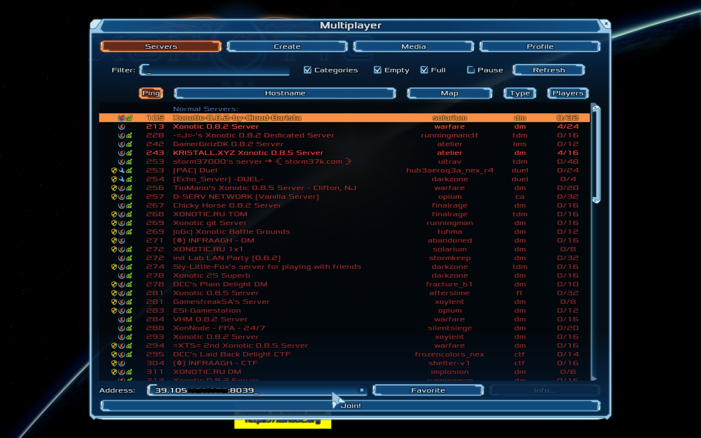
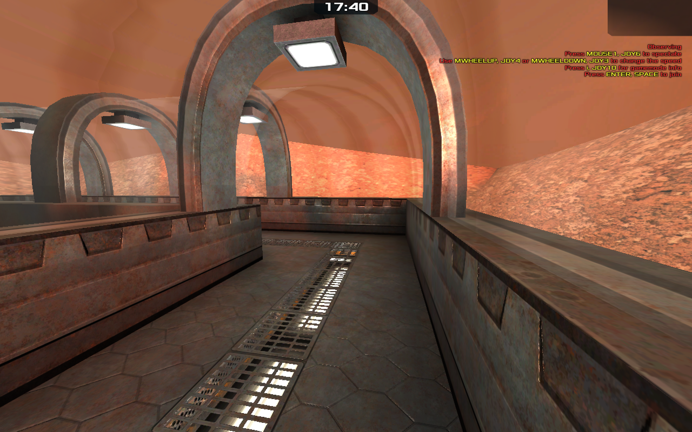

## PvP游戏

PvP游戏服为玩家提供战斗对局，常见的PvP游戏包括组队射击游戏、玩家卡牌对战、MOBA类游戏等。
这类游戏对局通常持续几十分钟至几个小时不等，生命周期较短。

PvP游戏特点：

- 不同游戏服的配置是近似相同的
- 游戏网络具有低延迟的需求
- 游戏服生命周期短，波峰波谷的资源用量差距较大
- 玩家进入哪个游戏服(游戏房间)由游戏匹配机制决定

OpenKruiseGame(OKG) 为PvP游戏提供的能力：

- 一键式游戏服部署
- 低延迟的网络模型
- 多种自动伸缩机制
- 适配开源匹配框架

## 游戏案例

 [xonotic](https://github.com/xonotic/xonotic) 是一款开源多人在线射击类游戏，在这里使用xonotic为例为大家演示如何利用OKG部署PvP游戏

网络方面使用HostPort暴露游戏服务，满足低延迟特性，同时部署了三个游戏服（房间）。

```bash
cat <<EOF | kubectl apply -f -
kind: GameServerSet
metadata:
  name: xonotic
  namespace: default
spec:
  replicas: 3
  network:
    networkType: HostPort
    networkConf:
    - name: ContainerPorts
      value: xonotic:26000/UDP
  updateStrategy:
    rollingUpdate:
      podUpdatePolicy: InPlaceIfPossible
    type: RollingUpdate
  gameServerTemplate:
    spec:
      containers:
        - image: registry.cn-hangzhou.aliyuncs.com/acs/xonotic-demo:statble
          name: xonotic
EOF
```
等待一会后，三个游戏服全部Ready

```bash
kubectl get gs
NAME        STATE   OPSSTATE   DP    UP
xonotic-0   Ready   None       0     0
xonotic-1   Ready   None       0     0
xonotic-2   Ready   None       0     0
```

查看xonotic-1的网络信息

```bash
kubectl get gs xonotic-1 -oyaml
...
status:
  networkStatus:
    createTime: "2022-12-08T12:12:36Z"
    currentNetworkState: Ready
    desiredNetworkState: Ready
    externalAddresses:
    - ip: 39.105.xxx.xxx
      ports:
      - name: xonotic-26000
        port: 8039
        protocol: UDP
    internalAddresses:
    - ip: 172.16.0.16
      ports:
      - name: xonotic-26000
        port: 26000
        protocol: UDP
...
```

打开xonotic客户端，输入对应服务IP端口，准备加入游戏。（市面上大多PvP游戏，玩家是进入游戏大厅后匹配其他玩家进入游戏，此处为简化示例而直接连接）



玩家顺利进入游戏



接下来，或许你还需要：

- [游戏服水平伸缩](../快速开始/游戏服水平伸缩.md)
- [自定义服务质量](../用户手册/自定义服务质量.md)
- [网络模型](../用户手册/网络模型.md)