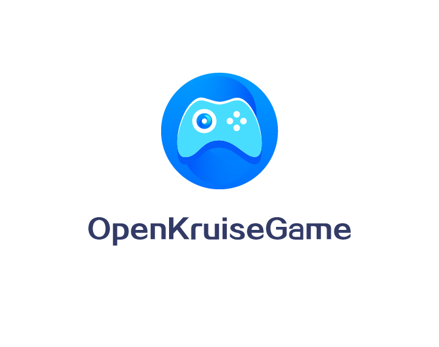
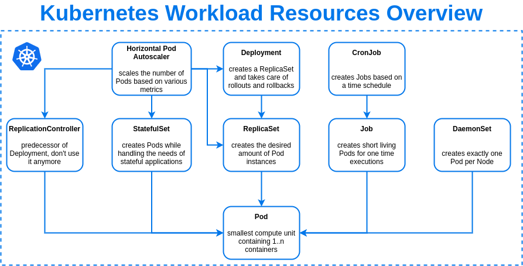
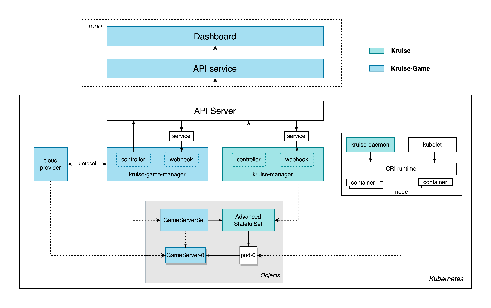

  

## 开源OpenKruiseGame（OKG)的初衷

我是从2015年开始做云原生产品的，从最开始的Swarm到后来的Kubernetes，在容器集群之上运行的负载类型从早期的网站、API服务到后来的转码、AI训练再到云宇宙、Web3、图形化应用。我们见证了云原生技术在改变一个又一个行业。但是，游戏是一个非常特殊的行业，一个大型的游戏，包含网关、平台服、游戏服、匹配服服务等不同种角色。很多游戏公司早已将平台服、网关等业务进行了云原生化改造，但是，游戏服的容器化进展都比较缓慢。通过和大量的游戏开发者/运维人员进行交流，大致可以归纳为如下三个重要的原因。

1. 运行中的游戏服更换部署架构的风险收益比过高。
2. 游戏服云原生化过程中存在缺失的核心功能，例如：游戏热更新，定向合服/停服等。
2. 缺少游戏服云原生化的最佳实践与成功案例。

为了解决上述问题，我们联合了灵犀互娱等多家游戏公司，将游戏服云原生化场景下的通用能力进行了抽象，开源了OpenKruiseGame项目。希望能够通过一个云厂商无关的开源项目，将游戏服的云原生化最佳实践交付给更多的游戏开发者。同时，我们也希望越来越多的游戏公司/工作室/开发者可以参与到社区，将遇到的难题、场景和大家一起讨论，分享游戏服云原生化的经验。

来自  刘中巍，阿里云容器服务，OpenKruiseGame项目发起人
     

在尝试对游戏服进行云原生化改造的过程中，网络是首要考虑的问题。由于游戏服从虚拟机迁移至容器，基于机器IP的运维方式在k8s中难以保障，衍生出固定IP的需求；对外服务的方式也不像直接在虚拟机暴露端口那么简单，增加了许多复杂性。除了网络问题之外，一个游戏服的各个进程在pod中的状态难以感知，原生k8s重建的策略太过“粗暴”，不利于游戏稳定运行，亟需一种针对性的感知策略，针对不同的探测结果执行不同的动作。

	来自 盛浩 冠赢互娱游戏云平台负责人

## 为什么OpenKruiseGame（OKG）是一个工作负载

  

游戏服云原生化核心要解决两个问题，游戏服的生命周期管理与游戏服的运维管理。Kubernetes内置了一些通用的工作负载模型，例如：无状态（Deployment）、有状态（StatefulSet）、任务（Job）等。但是，游戏服的状态管理不论从粒度还是确定性上面都有更高的要求。例如：游戏服需要热更新的机制来确保更短的游戏中断；游戏服需要原地更新确保元数据信息（网络为主）不变；游戏服需要确保在自动伸缩过程中只有0玩家的游戏服可以下线；需要具备手动运维/诊断/隔离任意一个游戏服的能力等。这些都是Kubernetes内置负载不能够解决的问题。

此外，Kubernetes中的工作负载还承担了与基础设施无缝整合的重要枢纽角色。例如：通过Annotations中的字段，自动实现监控系统、日志系统与应用的对接；通过nodeSelector字段，实现应用与底层资源的调度绑定关系；通过labels中的字段，记录分组等元数据信息，替代传统的CMDB系统。这些都让自定义工作负载成为了Kubernetes中适配不同类型应用的最佳方式，OpenKruiseGame（OKG）是一个完全面向游戏场景的Kubernetes工作负载，通过OpenKruiseGame（OKG），开发者不止可以获得更好的游戏服的生命周期管理和游戏服的运维管理，还可以以OpenKruiseGame（OKG）为纽带，无需开发额外的代码，充分发挥云产品带来的强大能力。

## OpenKruiseGame（OKG）的设计理念

OpenKruiseGame（OKG）只包含两个CRD对象：GameServerSet与GameServer。OpenKruiseGame（OKG）的设计理念是基于状态控制的，将不同的职责划分在不同的工作负载维度来控制。

* GameServerSet（生命周期管理）     
对一组GameServer的生命周期管理的抽象，主要用于副本数目管理、游戏服发布等生命周期控制。

* GameServer（定向管理运维动作）     
对一个GameServer的运维/管理动作的抽象，主要用于更新顺序控制、游戏服状态控制、游戏服网络变更等定向运维管理动作。

当我们理解了OpenKruiseGame（OKG）的设计理念后，一些非常有趣的推论就可以快速的得出，例如：

* 当不小心删除GameServer的时候会触发游戏服的删除吗？    
 
不会，GameServer只是游戏服的差异性运维动作的状态记录，如果删除GameServer之后，会重新创建一个使用默认配置的GameServer对象。此时，你的GameServer也会重置为默认定义在GameServerSet中的游戏服模板配置。

* 如何让匹配服务与自动伸缩更好的配合防止出现玩家被强制下线？    

可以通过服务质量能力，将游戏的玩家任务转换为GameServer的状态，匹配框架感知GameServer的状态并控制伸缩的副本数目，GameServerSet也会根据GameServer的状态来判断删除的顺序，从而实现优雅下线。

## OpenKruiseGame（OKG）的部署架构

  

OpenKruiseGame（OKG）的部署模型分为三个部分：

1. OpenKruiseGame（OKG）控制器     
负责管理GameServerSet与GameServer的生命周期管理，在OpenKruiseGame控制器中，内置一个Cloud Provider模块，用来适配不同云服务厂商在网络插件等场景下的差异，让OpenKruiseGame可以真正做到一套代码无差异部署。

2. OpenKruise控制器     
负责管理Pod的生命周期管理，是OpenKruiseGame（OKG）的依赖组件，对OpenKruiseGame（OKG）使用者/开发者是无感的。

3. OpenKruiseGame（OKG）运维后台【待完成】     
针对希望白屏化使用OpenKruiseGame（OKG）的开发者提供的运维后台与API，主要提供游戏服的生命周期管理和编排能力。
