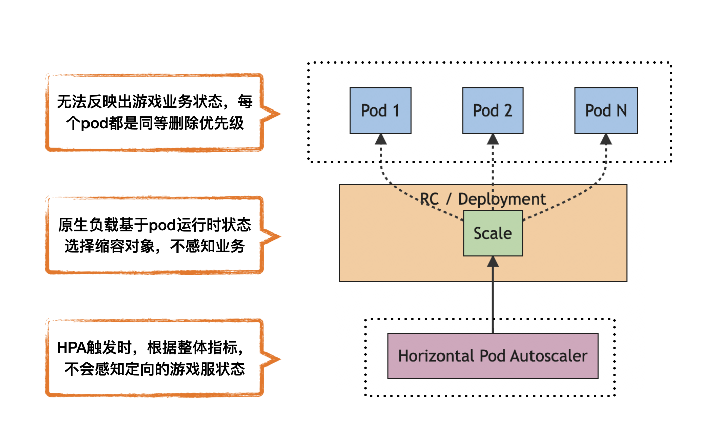
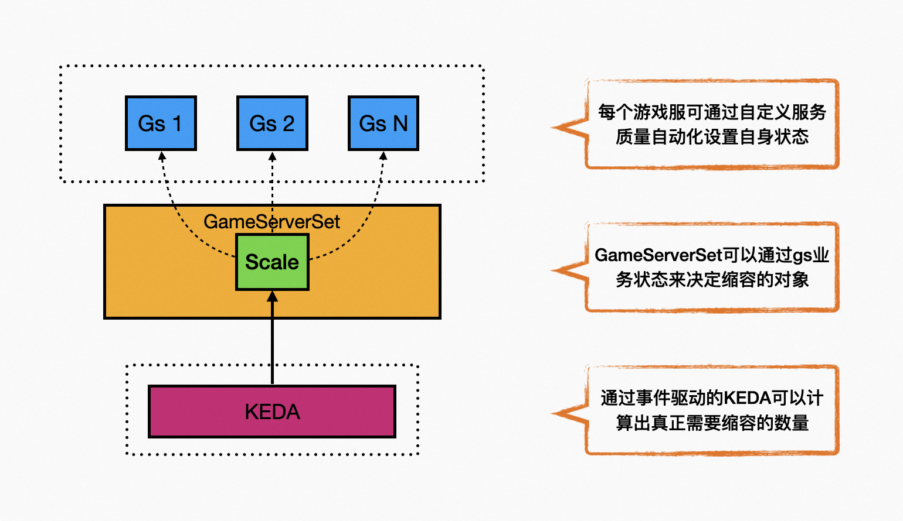

## 功能概览

### 自动缩容

游戏服与无状态业务类型不同，对于自动伸缩特性有着更高的要求，其要求主要体现在缩容方面。

由于游戏为强有状态业务，随着时间的推移，游戏服之间的差异性愈加明显，缩容的精确度要求极高，粗糙的缩容机制容易造成玩家断线等负面影响，给业务造成巨大损失。

原生Kubernetes中的水平伸缩机制如下图所示



在游戏场景下，它的主要问题在于：

- 在pod层面，无法感知游戏服业务状态，进而无法通过业务状态设置删除优先级
- 在workload层面，无法根据业务状态选择缩容对象
- 在autoscaler层面，无法定向感知游戏服业务状态计算合适的副本数目

这样一来，基于原生Kubernetes的自动伸缩机制将在游戏场景下造成两大问题：

- 缩容数目不精确。容易删除过多或过少的游戏服。
- 缩容对象不精确。容易删除业务负载水平高的游戏服。

OKG 的自动伸缩机制如下所示



- 在游戏服层面，每个游戏服可以上报自身状态，通过自定义服务质量或外部组件来暴露自身是否为WaitToBeDeleted状态。
- 在workload层面，GameServerSet可根据游戏服上报的业务状态来决定缩容的对象，如[游戏服水平伸缩](../快速开始/游戏服水平伸缩.md)中所述，WaitToBeDeleted的游戏服是删除优先级最高的游戏服，缩容时最优先删除。
- 在autoscaler层面，精准计算WaitToBeDeleted的游戏服个数，将其作为缩容数量，不会造成误删的情况。

如此一来，OKG的自动伸缩器在缩容窗口期内只会删除处于WaitToBeDeleted状态的游戏服，真正做到定向缩容、精准缩容。

**使用示例如下：**

_**前置条件：在集群中安装 [KEDA](https://keda.sh/docs/2.10/deploy/)**_

部署ScaledObject对象来设置自动伸缩策略，具体字段含义可参考 [ScaledObject API](https://github.com/kedacore/keda/blob/main/apis/keda/v1alpha1/scaledobject_types.go)

```yaml
apiVersion: keda.sh/v1alpha1
kind: ScaledObject
metadata:
  name: minecraft #填写对应GameServerSet的名称
spec:
  scaleTargetRef:
    name: minecraft #填写对应GameServerSet的名称
    apiVersion: game.kruise.io/v1alpha1 
    kind: GameServerSet
  pollingInterval: 30
  minReplicaCount: 0
  advanced:
    horizontalPodAutoscalerConfig: 
      behavior: #继承HPA策略，可参考文档 https://kubernetes.io/zh-cn/docs/tasks/run-application/horizontal-pod-autoscale/#configurable-scaling-behavior
        scaleDown:
          stabilizationWindowSeconds: 45 #设置缩容稳定窗口时间为45秒
          policies:
            - type: Percent
              value: 100
              periodSeconds: 15
  triggers:
    - type: external
      metricType: AverageValue
      metadata:
        scalerAddress: kruise-game-external-scaler.kruise-game-system:6000
```

部署完成后，更改gs minecraft-0 的 opsState 为 WaitToBeDeleted（可参考[自定义服务质量](自定义服务质量.md)实现自动化设置游戏服状态）

```bash
kubectl edit gs minecraft-0

...
spec:
  deletionPriority: 0 
  opsState: WaitToBeDeleted #初始为None, 将其改为WaitToBeDeleted
  updatePriority: 0
...
```

经过缩容窗口期后，游戏服minecraft-0自动被删除
```bash
kubectl get gs
NAME          STATE      OPSSTATE          DP    UP
minecraft-0   Deleting   WaitToBeDeleted   0     0
minecraft-1   Ready      None              0     0
minecraft-2   Ready      None              0     0

# After a while
...

kubectl get gs
NAME          STATE   OPSSTATE   DP    UP
minecraft-1   Ready   None       0     0
minecraft-2   Ready   None       0     0
```

### 自动扩容

除了设置自动缩容策略，也可以设置自动扩容策略。

#### 利用资源指标或自定义指标进行扩容

例如，原生Kubernetes支持使用CPU利用率进行扩容，其完整的yaml如下

```yaml
apiVersion: keda.sh/v1alpha1
kind: ScaledObject
metadata:
  name: minecraft #填写对应GameServerSet的名称
spec:
  scaleTargetRef:
    name: minecraft #填写对应GameServerSet的名称
    apiVersion: game.kruise.io/v1alpha1
    kind: GameServerSet
  pollingInterval: 30
  minReplicaCount: 0
  advanced:
    horizontalPodAutoscalerConfig:
      behavior: #继承HPA策略，可参考文档 https://kubernetes.io/zh-cn/docs/tasks/run-application/horizontal-pod-autoscale/#configurable-scaling-behavior
        scaleDown:
          stabilizationWindowSeconds: 45 #设置缩容稳定窗口时间为45秒
          policies:
            - type: Percent
              value: 100
              periodSeconds: 15
  triggers:
    - type: external
      metricType: AverageValue
      metadata:
        scalerAddress: kruise-game-external-scaler.kruise-game-system:6000
    - type: cpu
      metricType: Utilization # 允许的类型是 "利用率 "或 "平均值"
      metadata:
        value: "50"
```

对游戏服进行压测，可以看到游戏服开始扩容

```bash
kubectl get gss
NAME        DESIRED   CURRENT   UPDATED   READY   MAINTAINING   WAITTOBEDELETED   AGE
minecraft   5         5         5         0       0             0                 7s

# After a while

kubectl get gss
NAME        DESIRED   CURRENT   UPDATED   READY   MAINTAINING   WAITTOBEDELETED   AGE
minecraft   20        20        20        20      0             0                 137s
```

#### 设置opsState为None的游戏服的最小个数

OKG支持设置游戏服最小数目。在当前所有opsState为None的游戏服数量少于设置的值时，OKG将自动扩容出新的游戏服，使opsState为None的游戏服数量满足设置的最小个数。

配置方式如下，在此例中设置opsState为None的游戏服的最小个数为3：

```yaml
apiVersion: keda.sh/v1alpha1
kind: ScaledObject
metadata:
  name: minecraft #填写对应GameServerSet的名称
spec:
  scaleTargetRef:
    name: minecraft #填写对应GameServerSet的名称
    apiVersion: game.kruise.io/v1alpha1 
    kind: GameServerSet
  pollingInterval: 30
  minReplicaCount: 0
  advanced:
    horizontalPodAutoscalerConfig: 
      behavior: #继承HPA策略，可参考文档 https://kubernetes.io/zh-cn/docs/tasks/run-application/horizontal-pod-autoscale/#configurable-scaling-behavior
        scaleDown:
          stabilizationWindowSeconds: 45 #设置缩容稳定窗口时间为45秒
          policies:
            - type: Percent
              value: 100
              periodSeconds: 15
  triggers:
    - type: external
      metricType: AverageValue
      metadata:
        minAvailable: "3" # 设置opsState为None的游戏服的最小个数
        scalerAddress: kruise-game-external-scaler.kruise-game-system:6000
```

初始部署replicas为1的GameServerSet，经过KEDA探测周期后，马上扩容出两个新的游戏服。此时opsState为None的游戏服数量不小于设置的minAvailable值，完成了自动扩容。

```bash
kubectl get gs
NAME          STATE   OPSSTATE   DP    UP   AGE
minecraft-0   Ready   None       0     0    7s

# After a while

kubectl get gs
NAME          STATE   OPSSTATE   DP    UP   AGE
minecraft-0   Ready   None       0     0    20s
minecraft-1   Ready   None       0     0    5s
minecraft-2   Ready   None       0     0    5s
```
