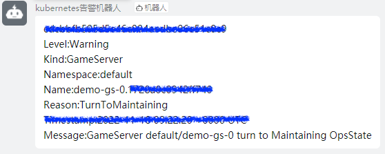

## 功能概述

由于游戏是有状态服务，很多时候游戏服是以一种 "富容器" 的形态存在于Pod之中，多个进程在Pod中统一管理。
然而，每个进程重要性却有所不同，对于"轻量级进程"错误的情况，用户并不希望将整个pod删除重建，像k8s原生的liveness probe并不能很好地满足这种需求，过于僵化的模式与游戏场景并不适配。
OKG 认为游戏服的服务质量水平应该交由游戏开发者定义，开发者可以根据不同游戏服状态去设置对应的处理动作。自定义服务质量功能是探测+动作的组合，通过这种方式帮助用户自动化地处理各类游戏服状态问题。

## 使用示例

### 游戏服空闲设置即将下线

部署一个带有自定义服务质量的GameServerSet：
```shell
cat <<EOF | kubectl apply -f -
apiVersion: game.kruise.io/v1alpha1
kind: GameServerSet
metadata:
  name: minecraft
  namespace: default
spec:
  replicas: 3
  gameServerTemplate:
    spec:
      containers:
        - image: registry.cn-hangzhou.aliyuncs.com/gs-demo/gameserver:idle
          name: minecraft
  updateStrategy:
    rollingUpdate:
      podUpdatePolicy: InPlaceIfPossible
      maxUnavailable: 100%
  serviceQualities: # 设置了一个idle的服务质量
    - name: idle
      containerName: minecraft
      permanent: false
      #与原生probe类似，本例使用执行脚本的方式探测游戏服是否空闲，不存在玩家
      exec:
        command: ["bash", "./idle.sh"]
      serviceQualityAction:
          #不存在玩家，标记该游戏服运维状态为WaitToBeDeleted
        - state: true
          opsState: WaitToBeDeleted
          #存在玩家，标记该游戏服运维状态为None
        - state: false
          opsState: None
EOF
```

部署完成后，由于还未导入玩家，故所有游戏服都为空闲状态，可以任意被删除：
```shell
kubectl get gs
NAME          STATE   OPSSTATE          DP    UP
minecraft-0   Ready   WaitToBeDeleted   0     0
minecraft-1   Ready   WaitToBeDeleted   0     0
minecraft-2   Ready   WaitToBeDeleted   0     0
```

当有玩家进入游戏服minecraft-1，则游戏服的运维状态发生变化：
```shell
kubectl get gs
NAME          STATE   OPSSTATE          DP    UP
minecraft-0   Ready   WaitToBeDeleted   0     0
minecraft-1   Ready   None              0     0
minecraft-2   Ready   WaitToBeDeleted   0     0
```

此时若发生缩容，游戏服minecraft-1将得到保护，避免优先删除。

### 游戏服状态异常设置维护中

部署一个带有自定义服务质量的GameServerSet：
```shell
cat <<EOF | kubectl apply -f -
apiVersion: game.kruise.io/v1alpha1
kind: GameServerSet
metadata:
  name: demo-gs
  namespace: default
spec:
  replicas: 3
  gameServerTemplate:
    spec:
      containers:
        - image: registry.cn-hangzhou.aliyuncs.com/gs-demo/gameserver:healthy
          name: minecraft
  updateStrategy:
    rollingUpdate:
      podUpdatePolicy: InPlaceIfPossible
      maxUnavailable: 100%
  serviceQualities: # 设置了一个healthy的服务质量
    - name: healthy
      containerName: minecraft
      permanent: false
      #与原生probe类似，本例使用执行脚本的方式探测游戏服是否健康
      exec:
        command: ["bash", "./healthy.sh"]
      serviceQualityAction:
          #探测健康，标记该游戏服运维状态为None
        - state: true
          opsState: None
          #探测不健康，标记该游戏服运维状态为Maintaining
        - state: false
          opsState: Maintaining
EOF
```

部署完成后，由于一切正常，故所有游戏服都为None：
```shell
kubectl get gs
NAME        STATE   OPSSTATE   DP    UP
demo-gs-0   Ready   None       0     0
demo-gs-1   Ready   None       0     0
demo-gs-2   Ready   None       0     0
```

模拟demo-gs-0某进程宕机，游戏服变为Maintaining状态：
```shell
kubectl get gs
NAME        STATE   OPSSTATE     DP    UP
demo-gs-0   Ready   Maintaining  0     0
demo-gs-1   Ready   None         0     0
demo-gs-2   Ready   None         0     0
```

此时gameserver controller会发出 GameServer demo-gs-0 Warning 的 event，配合[kube-event项目](https://github.com/AliyunContainerService/kube-eventer)可实现异常通知：



此外，OKG 未来会集成游戏服自动排障/恢复工具，进一步丰富游戏服的自动化运维能力。