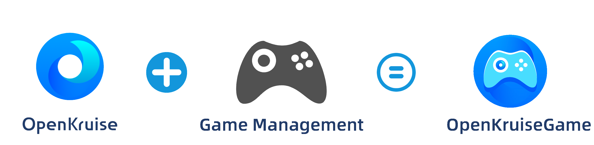
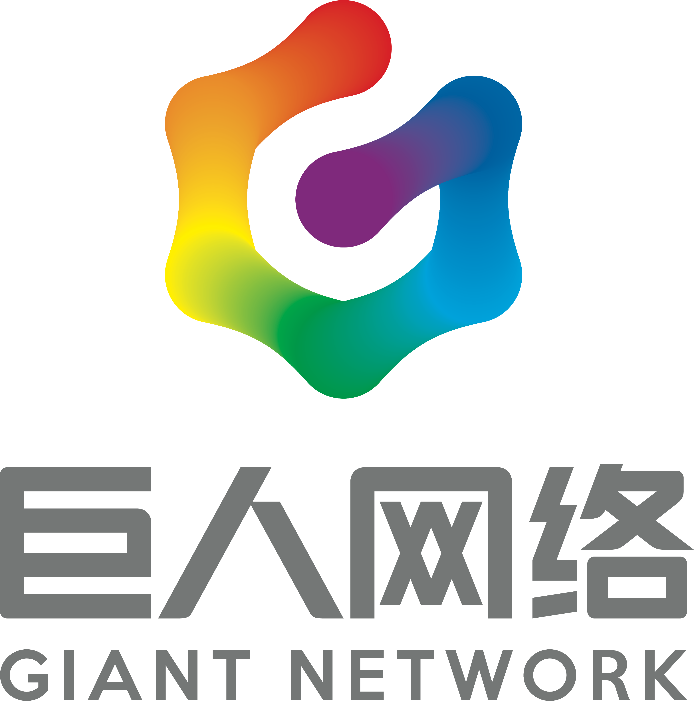
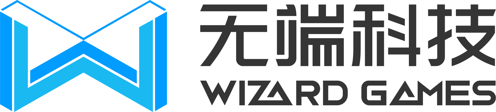
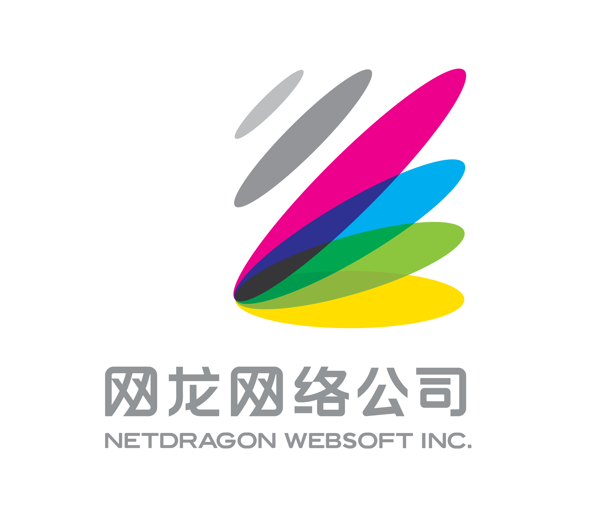

## kruise-game

[英文](../en/introduction.md) | 中文
### 概览

OpenKruiseGame（OKG）是一个面向多云的开源游戏服Kubernetes工作负载，是CNCF工作负载开源项目OpenKruise在游戏领域的子项目，让游戏服的云原生化变得更加简单、快速、稳定。

  

### 什么是OpenKruiseGame(OKG)
OpenKruiseGame（OKG）是简化游戏服云原生化的自定义Kubernetes工作负载，相比Kubernetes内置的无状态（Deployment）、有状态（StatefulSet）等工作负载而言，OpenKruiseGame（OKG）提供了热更新、原地升级、定向管理等常用的游戏服管理功能，是完全面向游戏服场景而设计的Kubernetes工作负载。   

除此之外，OpenKruiseGame（OKG）还承担了游戏服与云服务、匹配服务、运维平台对接的角色，通过低代码或者0代码的方式实现游戏服云原生化时日志、监控、网络、存储、弹性、匹配等功能的自动化集成，通过Kubernetes的一致性交付标准，实现多云/混合云/多集群的统一管理。   

OpenKruiseGame（OKG）是一个完全开源的项目，开发者可以通过二次开发的方式定制属于自己的游戏服工作负载，构建游戏服的发布运维后台等。除了通过Kubernetes的模板/API的方式进行调用和扩展，OpenKruiseGame（OKG）还支持与KubeVela等交付系统进行对接，通过白屏化的方式实现游戏服的编排与全生命周期管理。

### 为什么需要OpenKruiseGame(OKG)

Kubernetes作为云原生时代的应用交付/运维标准，其具备的声明式资源管理、自动弹性伸缩、多云环境一致性交付等能力与游戏服的场景是非常匹配的，能够在开服效率、成本控制、版本管理、全球同服等场景提供支持。但是，游戏服的一些特性导致了它与Kubernetes进行适配的时候存在一些障碍，例如：

* 热更新/热重载    

为了让玩家能够得到更好的游戏体验，很多游戏服都是通过热更新或者配置热重载的方式进行更新，而在Kubernetes的各种不同负载中，Pod的生命周期和镜像的生命周期是一致的，当业务的镜像需要发布的时候，Pod会进行重建，而重建Pod的代价往往意味着玩家对局的中断，玩家服网络元数据的变更等。

* 定向运维管理   

玩家服在大部分的场景下是有状态的，例如PVP游戏在更新或者下线的时候，应该优先且只能变更没有活跃玩家在线的游戏服；PVE游戏在停服或者合服的时候，应该能够定向管理特定ID的玩家服。

* 适合游戏的网络模型   

Kubernetes中的网络模型是通过Service进行抽象的，更多的是面向无状态场景的适配。对于网络敏感的游戏服而言，高性能网关或者IP端口固定的无损直连的方案更符合真实的业务场景。

* 游戏服编排   

当下的游戏服架构越来越复杂，很多MMORPG的玩家服已经抽象成了多种不同功能和用途的游戏服的组合，例如：负责网络接入的网关服、负责游戏引擎的中心服，负责游戏脚本和玩法的策略服等。每个游戏服的容量和管理策略有所不同，通过单一的负载类型很难描述和快速交付。
  
这些能力的缺失，让游戏服进行云原生化变得非常困难。OpenKruiseGame（OKG）设计的初衷就是将这些游戏行业通用的需求进行抽象，通过语义化的方式，将不同类型游戏服的云原生化过程变得简单、高效、安全。

### 核心功能列表

OpenKruiseGame（OKG）具有如下核心能力：

* 镜像热更新/配置热重载
* 定向更新/删除/隔离
* 内置多种网络模型（IP端口不变/无损直连/全球加速）
* 自动弹性伸缩
* 自动化运维管理（服务质量）
* 云服务厂商无关
* 复杂的游戏服务编排

### 谁在使用OpenKruiseGame(OKG)

<table>
    <tr style="border: none;">
        <td style="border: none;">

</td>
        <td style="border: none;">

</td>
        <td style="border: none;">

</td>
        <td style="border: none;">

</td>
        <td style="border: none;">

</td>
        <td style="border: none;">

</td>
    </tr>
    <tr style="border: none;">
        <td style="border: none;">

</td>
        <td style="border: none;">

</td>
        <td style="border: none;">

</td>
        <td style="border: none;">

</td>
        <td style="border: none;">

</td>
        <td style="border: none;">

</td>
    </tr>
    <tr style="border: none;">
        <td style="border: none;">

</td>
        <td style="border: none;">

</td>
        <td style="border: none;">

</td>
        <td style="border: none;">

</td>
        <td style="border: none;">

</td>
        <td style="border: none;">

</td>
    </tr>
    <tr style="border: none;">
        <td style="border: none;">

</td>
        <td style="border: none;">

</td>
        <td style="border: none;">

</td>
        <td style="border: none;">

</td>
        <td style="border: none;">

</td>
        <td style="border: none;">

</td>
    </tr>
    <tr style="border: none;">
        <td style="border: none;">

</td>
        <td style="border: none;">

</td>
        <td style="border: none;">

</td>
        <td style="border: none;">

</td>
        <td style="border: none;">

</td>
        <td style="border: none;">

</td>
    </tr>
</table>

### 进行下一步

* 查看[快速开始](./快速开始)，安装并体验OpenKruiseGame。
* 查看[开发指南](./开发者手册/如何贡献代码.md)，为OpenKruiseGame(OKG)提交代码。
* 提交[Issue](https://github.com/openkruise/kruise-game/issues)，给OpenKruiseGame提建议或者讨论游戏云原生化的最佳实践。
* 加入钉钉群（44862615），在线和OpenKruiseGame(OKG)的核心贡献者讨论。
* 发送E-mail，联系我们。邮箱地址：zhongwei.lzw@alibaba-inc.com。

